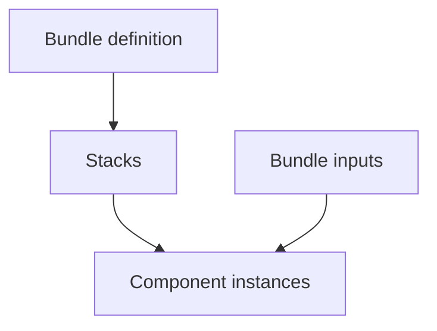

# Bundles

Bundles are higher‑level abstractions that compose one or more [Components](./components.md) into a cohesive, opinionated infrastructure unit. They hide Terraform/OpenTofu details from consumers while encoding organizational best practices.

### What a Bundle provides

- Clear inputs with sensible defaults
- Opinionated wiring of Components
- Standardized naming, tagging, and security defaults
- Definition of stacks the bundle will create/maintain
- Explicit input contract (chooses which settings are exposed to developers, sets defaults/validation, hides provider/module/state details)
- Scaffolding defaults (where the instance file is written and its default name)
  - **Note:** Generated IaC is written to bundle stacks during generation, not when scaffolding the instance file.
- Environment strategy the bundle targets (e.g., Terraform workspaces, directory layout, Terragrunt, etc.)

### Key properties

- A repository may host many bundle definitions (each in its own directory).
- Bundles are instantiated by creating a Bundle Instantiation (YAML or HCL). Scaffolding (`terramate scaffold`) can generate this file for you.
- Generated code is plain Terraform, OpenTofu, Terragrunt, or any other native IaC and works with existing tooling.

### Diagram



### Bundle definition (at a glance)

Defines the reusable bundle (class, inputs) and wires a component in a stack.

```hcl
define bundle metadata {
  class   = "example.com/my-bundle"
  version = "1.0.0"
  name    = "My Bundle"
}

define bundle {
  input "name" {
    type                   = string
    description            = "Service name"
    required_for_scaffold  = true
  }
}

define bundle stack "service" {
  component "svc" {
    source = "/components/example.com/my-component/v1"
    inputs = {
      name = bundle.input.name.value
    }
  }
}
```

### Bundle instantiation (at a glance)

Shows how a developer instantiates the bundle; YAML is default (created via CLI flow with `terramate scaffold`), HCL also supported.

::::: code-group

```yaml [YAML]
# file: bundle.tm.yml or bundle.tm.yaml
apiVersion: terramate.io/cli/v1
kind: BundleInstance
metadata:
  name: my-svc
spec:
  source: /bundles/example.com/my-bundle
  inputs:
    name: my-svc
```

```hcl [HCL]
# file: bundle.tm.hcl or bundle.tm
bundle "my-svc" {
  source = "/bundles/example.com/my-bundle"
  inputs {
    name = "my-svc"
  }
}
```

:::::

### Related guides and references

- How‑to: [Instantiate a bundle via CLI](/catalyst/how-to/instantiate-bundle-cli)
- Reference: [Bundle instantiation syntax](/cli/reference/blocks/bundle)
- Reference: [Bundle definition syntax](/cli/reference/blocks/define-bundle)
