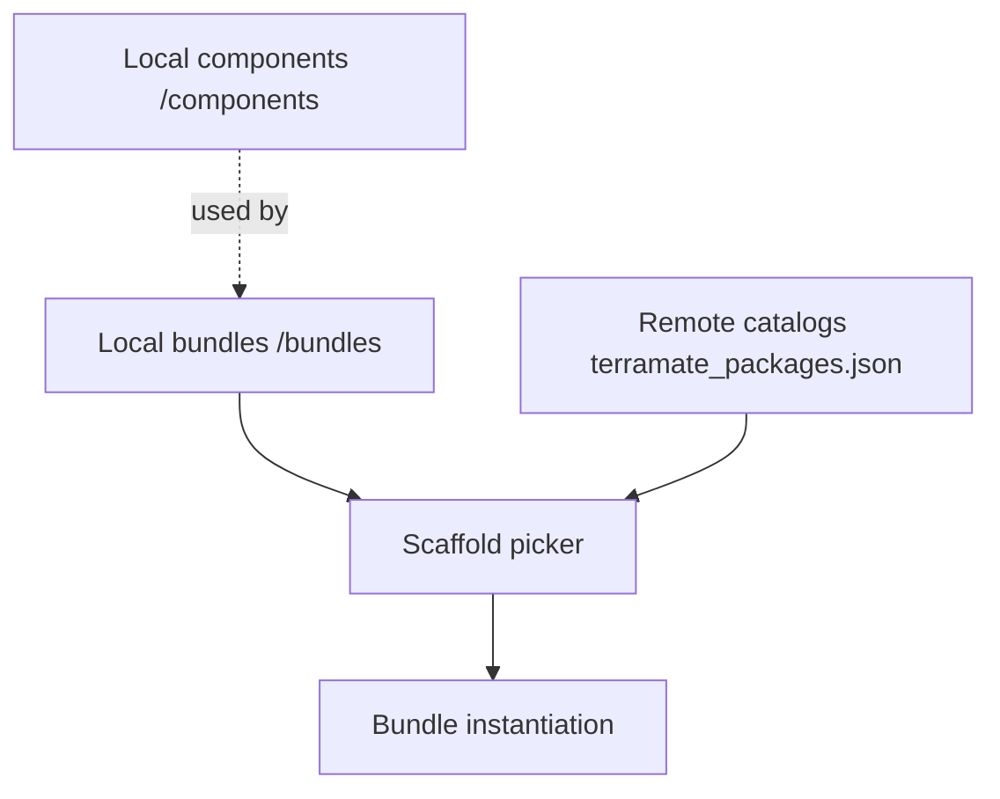

# Collections

Collections determine which Bundles and Components are available to users when running scaffolding.

### Diagram



### Local collections

- All local bundles under `/bundles` in the current repository are automatically available to `terramate scaffold`.
- Local components under `/components` are not listed directly in the `scaffold` picker. They are intended to be consumed by bundle definitions, for example:

  ```hcl
  define bundle stack "example" {
    component "svc" {
      source = "/components/example.com/terramate-aws-ecs-service/v1"
      inputs = { /* … */ }
    }
  }
  ```
  No extra configuration is required beyond placing component definitions under `/components/...`.

### Remote collections

- Remote catalogs expose Bundles/Components through a `terramate_packages.json` file at the repository root.
- Add remote sources to `scaffold.package_sources` in `terramate.tm.hcl` to make them selectable during scaffolding.

### Example terramate_packages.json (remote)

```json
[
  {
    "name": "My Catalog",
    "description": "Contains examples",
    "bundles": [
      {
        "path": "/bundles/my-bundle",
        "name": "Example bundle",
        "class": "my-org/my-bundle",
        "version": "1.0.0"
      }
    ],
    "components": [
      {
        "path": "/components/my-component",
        "name": "Example component",
        "class": "my-org/my-component",
        "version": "1.0.0"
      }
    ]
  }
]
```

### Notes

- `terramate scaffold` currently lists bundles for instantiation. Components included in a catalog are available for bundle authors to reference via their `source`, e.g.:
  ```
  source = "github.com/my-org/my-repo//components/my-component/v1?ref=v1.0.0"
  ```
- Use the `scaffold { package_sources = [...] }` block to control which remote catalogs are visible. There is no separate `component_sources`; components are discovered from those same catalogs.

### Configure package sources

```hcl
scaffold {
  package_sources = [
    "github.com/my-org/my-repo?ref=v1.0.0",
    "https://my-org.com/releases/v1.zip"
  ]
}
```

### Related guides and references

- How‑to: [Use a remote catalog with scaffolding](/catalyst/how-to/use-remote-catalog)
- CLI: [terramate package create](/cli/reference/cmdline/package/package-create)
- Reference: [Component Definition](/catalyst/reference/component-definition)
