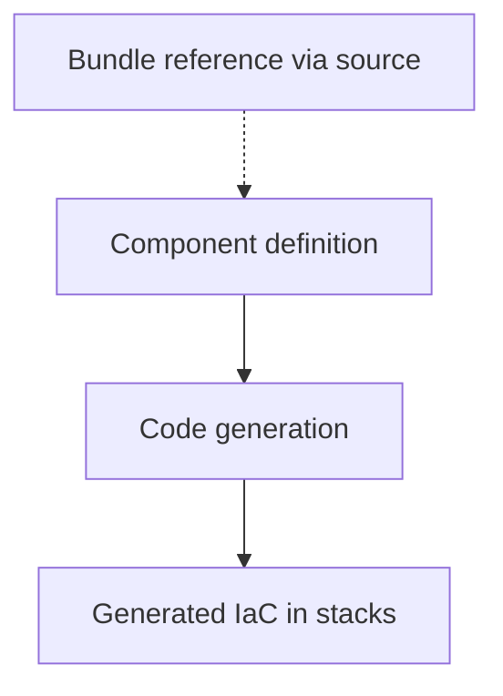

# Components

Components are the foundational building blocks in Catalyst. A Component encapsulates a single infrastructure capability (e.g., VPC, database, queue) including:

- Underlying Terraform/OpenTofu module wiring
- Inputs and outputs
- Naming/tagging conventions
- Security and compliance defaults

### Diagram



### Characteristics

- Defined and owned by platform teams
- Reusable across Bundles
- Policy‑aware and opinionated
- Implemented using Terraform/OpenTofu modules or any IaC the team chooses

Developers typically do not use Components directly. Instead, Components are instantiated within Bundle stacks.

### Example

```hcl
define component metadata {
  class   = "example.com/my-component"
  version = "1.0.0"
  name    = "My Component"
}

define component {
  input "name" {
    type        = string
    description = "Service name"
  }
}
```

### Related guides and references

- Reference: [Component definition syntax](/catalyst/reference/component-definition)
- How‑to: [Convert a TF module to a Component](/catalyst/how-to/convert-module-to-component)
