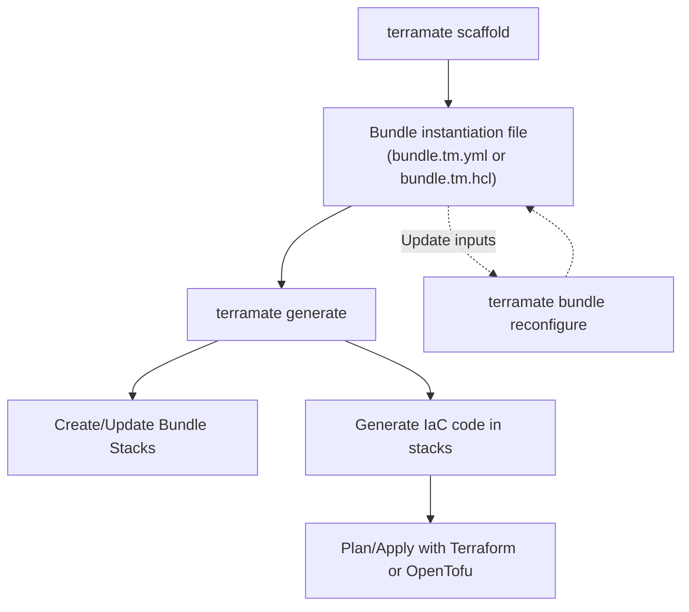

# Scaffolding and Code Generation

Catalyst enables a guided flow:

1) Scaffold a Bundle
- Run `terramate scaffold` to select a Bundle (from local or remote collections) and provide inputs via prompts.
- The command writes a Bundle Instantiation file (HCL or YAML) at the location defined by the bundle's scaffolding configuration.

2) Generate code
- Run `terramate generate`. With bundles present, this will:
  - Create Bundle Stacks if they do not already exist
  - Generate Terraform code and files in those stacks
  - Preserve existing stack metadata (stack configuration is not changed)
  - Remove generated code if the bundle instantiation is removed, without deleting stacks

> [!TIP]
> Use `terramate scaffold --generate` to combine steps 1 and 2 into a single command.

3) Reconfigure (optional)
- Run `terramate bundle reconfigure` to update an existing bundle instance interactively.
- The command opens the same TUI used during scaffolding, pre-filled with the current input values.
- Inputs marked as `immutable` are displayed as read-only notes and cannot be changed.
- After reconfiguring, run `terramate generate` to update the generated code.

4) Plan/apply with your normal tooling
- The generated code is plain Terraform/OpenTofu and works with your existing pipelines and policy engines.

### Flow diagram

### Related guides and references

- How‑to: [Instantiate a bundle via CLI](/catalyst/how-to/instantiate-bundle-cli)
- How-to: [Reconfigure a Bundle](/catalyst/how-to/reconfigure-bundle)
- Reference: [Bundle scaffolding config](/catalyst/reference/bundle-definition#bundle-scaffolding-hcl-block)
- Reference: [`terramate generate`](/cli/reference/cmdline/generate.md)
