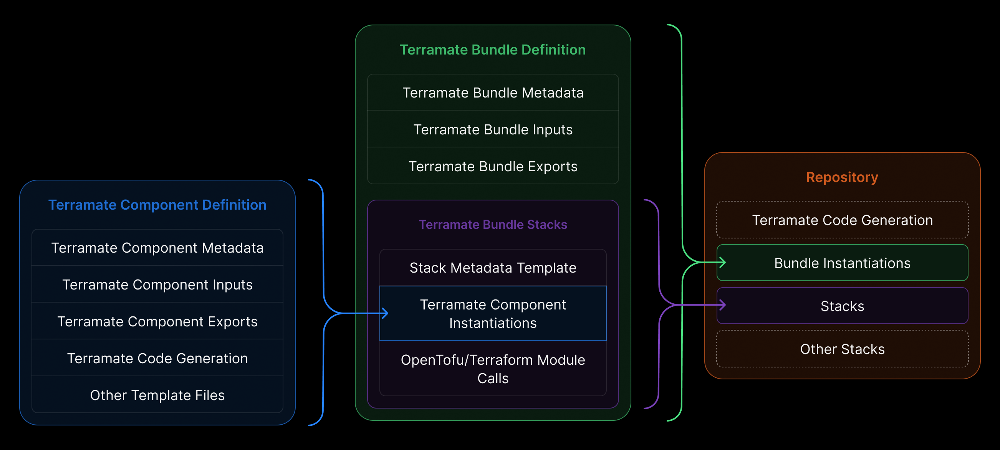

# Why Terramate Catalyst?

Your product teams already rely on a design system to ensure a consistent look, feel, and quality across everything they ship. Infrastructure should be just as repeatable and reliable.

**Platform teams** can’t scale if every app team hand‑crafts infrastructure. **Developers** shouldn’t need to become Terraform experts to ship securely. Even with powerful IaC tools, many organizations struggle with:

- Learning HCL and cloud internals  
- Safely managing remote state  
- Composing modules and structuring environments  
- Keeping stacks consistent across environments  
- Handling day‑2 operations (upgrades, drift remediation)

The result is a bottleneck where a few experts gatekeep infrastructure delivery. Catalyst exists to remove that bottleneck by packaging best practices so teams can move faster, safely.

## What is Terramate Catalyst?

Terramate Catalyst helps developers deploy and manage infrastructure in a self‑service way using IaC tools like Terraform, OpenTofu, or Terragrunt—packaged as reusable Terramate Bundles. Bundles are easy to create, version, share, and publish, so you can stop copy‑and‑paste and enforce consistency.

At its core, Catalyst introduces two new primitives that change how infrastructure is delivered and consumed inside organizations: **Bundles** and **Components**.

### Components

[**Components**](./concepts/components.md) are the foundational building blocks in Catalyst.

A Component represents a single, opinionated infrastructure capability, such as:

- A VPC
- A PostgreSQL database
- An S3 bucket
- A Kubernetes cluster
- A message queue

Components are:

- Defined and owned by platform teams
- Implemented using Terraform modules or any other arbitrary IaC
- Opinionated and policy-aware
- Reusable across Bundles

A Component encapsulates:

- Terraform module wiring
- Required inputs and outputs
- Naming conventions
- Tagging standards
- Security and compliance defaults

### Bundles

[**Bundles**](./concepts/bundles.md) are higher-level abstractions built by composing one or more Components.

A Bundle answers questions like:

> “What infrastructure does a typical service need in our organization?”

Examples:
- A “web service” bundle (VPC, load balancer, database, IAM roles)
- A “data pipeline” bundle (storage, queues, compute, observability)
- An “internal tool” bundle with restricted access patterns

Bundles:

- Hide Terraform and infrastructure topology from consumers
- Encode organizational best practices
- Define sensible defaults while remaining configurable
- Define how environments are managed
- Can be versioned and shared across teams

Developers interact primarily with Bundles, not Components.

## How does Catalyst compare to Terraform and OpenTofu?

Catalyst does **not** replace Terraform or OpenTofu. Instead, it bundles existing IaC into easy‑to‑use bundles that developers can use to create new environments. You can onboard Catalyst to any existing project.

Key characteristics:

- Generated code is plain Terraform
- Existing Terraform tooling continues to work
- State is managed using standard Terraform backends
- Teams can inspect, audit, and debug generated output

This ensures Catalyst remains compatible with:
- Existing Terraform ecosystems
- CI/CD pipelines
- Security scanning tools
- Policy engines

## Governance and Control

Catalyst enables strong governance without slowing teams down:

- Platform teams control the shape of infrastructure through Components and Bundles
- Consumers are constrained to safe, approved configurations
- Drift is minimized through standardization
- Changes are reviewed and versioned in Git

This model scales across:
- Multiple teams
- Multiple environments
- Multiple cloud accounts
- Large organizations with strict compliance needs

## Self-Service Infrastructure

Catalyst is designed to be consumed through multiple interfaces:

- CLI workflows
- CI/CD automation
- Internal developer portals
- AI agents and automation systems

Because infrastructure intent is declared at a high level, Catalyst enables **true self-service** without sacrificing reliability or security.

## When to Use Catalyst

Catalyst is a good fit if you:

- Operate a platform team supporting multiple product teams
- Want to standardize infrastructure without blocking developers
- Are struggling with Terraform sprawl or duplication
- Need stronger governance and clearer ownership boundaries
- Want infrastructure definitions that are easy for humans *and machines* to consume

## Next steps

- [Install Terramate Catalyst CLI](./installation.md)
- [Tutorial: Technical introduction](https://terramate.io/rethinking-iac/technical-introduction-to-terramate-catalyst/)
- Learn about the Concepts in Catalyst:
  - [Bundles](/catalyst/concepts/bundles)
  - [Components](/catalyst/concepts/components)
  - [Collections](/catalyst/concepts/collections)
  - [Scaffolding & Generation](/catalyst/concepts/scaffolding-and-generation)

