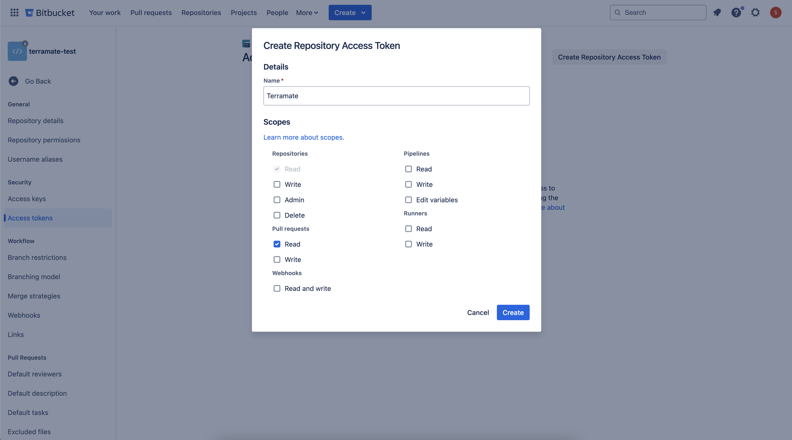

# Automating Terramate in BitBucket Pipelines

Your Bitbucket repositories can use CI/CD using the Bitbucket Pipelines to automate software builds, tests, and deployments. You can do GitOps in Bitbucket, automating the IaC workflow with CI/CD.

Terramate integrates seamlessly with Bitbucket Pipelines to automate and orchestrate IaC tools like Terraform and OpenTofu.

::: info
To use Terramate CLI in BitBucket version, the minimum required installed version is Terramate CLI `v0.11.5`.
:::

## Terramate Blueprints

This page explains the workflow setup and authentication flows common in the following workflows.

To jump directly to the Blueprints, follow the links below:

- [Pull Request Preview Workflow Blueprints](./preview-workflow.md)
- [Deployment Workflow Blueprints](./deployment-workflow.md)
- [Drift Check Workflow Blueprints](./drift-check-workflow.md)

The pipelines in these examples rely on a few Shell scripts to run different parts of the workflow. All these scripts are created inside a folder called `bitbucket-scripts`. The following sections describe how each of these scripts works.

## Installing the necessary packages

The workflows in these examples use the `google/cloud-sdk` docker image based on a minimal image and include the `gcloud` packages.

With Terraform and Terramate already installed, you still need additional packages for the workflows to function. Use `asdf` for installation, which depends on the `.tool-versions` file.

Create the following at `bitbucket-scripts/install.sh`
```bash
#!/bin/bash

set -euo pipefail

apt-get install -y unzip jq
git clone https://github.com/asdf-vm/asdf.git ~/.asdf --branch v0.14.0 && . ~/.asdf/asdf.sh
asdf plugin add terraform
asdf plugin add terramate
asdf install
```

And `.tool-versions`
```
terraform 1.9.3
terramate 0.11.5
```

## Authenticating to Terramate Cloud

To enable the Terramate CLI to push data to your Terramate Cloud account, create a repository access token for your Bitbucket repository and an API key for your Terramate Cloud organization.

### BitBucket Repository Access Token

A repository access token is required for Terramate CLI to read metadata, such as information about Pull Requests from
your repository.

1. In your repository settings (e.g., `https://bitbucket.org/WORKSPACE/REPO_NAME/admin/access-tokens`), create a repository access token with the required scopes: `Repositories: read` and `Pullrequests: read`.



2. After generating the access token, navigate to **Repository variables** in the repository settings (e.g., `https://bitbucket.org/WORKSPACE/REPO_NAME/admin/pipelines/repository-variables`).

3. Create a variable named `BITBUCKET_TOKEN` with the generated access token as its value. Check the `Secured` checkbox to store it as a secret.


### Terramate Cloud API Key

To enable the Terramate CLI to push data to your Terramate Cloud organization from Bitbucket Pipelines, you need a [Terramate Cloud API key](../../../cloud/organization/api-keys.md).

1. Go to the settings page of your Terramate Cloud organization and create a new API key.


2. Navigate to Repository variables in the repository settings (e.g., https://bitbucket.org/WORKSPACE/REPO_NAME/admin/pipelines/repository-variables).

3. Create a variable named TMC_TOKEN with the API key as its value. Check the Secured checkbox to store it as a secret.


## Authenticating to Google Cloud

This script requires 2 inputs: Workload Identity Provider (WIP) ID and the Service Account email.

Create the following file at `bitbucket-scripts/gcp-oidc-auth.sh`

```bash
#!/bin/bash

WORKLOAD_IDENTITY_PROVIDER=$1
SERVICE_ACCOUNT=$2

echo "${BITBUCKET_STEP_OIDC_TOKEN}" > /tmp/gcp_access_token.out
gcloud iam workload-identity-pools create-cred-config "${WORKLOAD_IDENTITY_PROVIDER}" --credential-source-file=/tmp/gcp_access_token.out --service-account="${SERVICE_ACCOUNT}" --output-file=/tmp/sts-creds.json
export GOOGLE_APPLICATION_CREDENTIALS=/tmp/sts-creds.json
gcloud auth login --cred-file=/tmp/sts-creds.json
```

## Terraform plan

Create the following file at `bitbucket-scripts/terraform-plan.sh`

```bash
#!/bin/bash

terramate run --changed -- terraform init -lock-timeout=5m
terramate run \
  --changed \
  --sync-preview \
  --terraform-plan-file=out.tfplan \
  -- \
  terraform plan -lock-timeout=5m -detailed-exitcode -out out.tfplan
```

## Terraform apply

Create the following file at `bitbucket-scripts/terraform-apply.sh`

```bash
#!/bin/bash

terramate run --changed -- terraform init -lock-timeout=5m
terramate run --changed -- terraform plan -lock-timeout=5m -out out.tfplan
# Deploy changed stacks
terramate run \
  --changed \
  --sync-deployment \
  --terraform-plan-file=out.tfplan \
  -- \
  terraform apply -input=false -auto-approve -lock-timeout=5m out.tfplan
# Check deployed stacks for drift
terramate run \
  --changed \
  --sync-drift-status \
  --terraform-plan-file=out.tfplan \
  -- \
  terraform plan -lock-timeout=5m -detailed-exitcode -out out.tfplan
```

## Scheduled Drift Detection

Create the following file at `bitbucket-scripts/drift.sh`

```bash
#!/bin/bash

terramate run -- terraform init -lock-timeout=5m
terramate run \
  --sync-drift-status \
  --terraform-plan-file=out.tfplan \
  -- \
  terraform plan -lock-timeout=5m -detailed-exitcode -out out.tfplan
```

::: info
To make drift detection run on a schedule, please follow the instructions in the Bitbucket documentation: https://support.atlassian.com/bitbucket-cloud/docs/pipeline-triggers/
:::

## Pull Request comment

This script uses the Bitbucket REST API to post the Terraform plan as a PR comment, making reviews easier.

Create a user as whom the comments will be posted. This can be a normal user since Bitbucket [does not support bot accounts](https://confluence.atlassian.com/bbkb/support-for-service-or-bot-accounts-in-bitbucket-cloud-1224770514.html).

The script requires 2 environment variables to be created in the repository setting. These variables should be marked as "Secured":
- `BB_USER`: Username of the bot user.
- `BB_APP_KEY`: [App password](https://bitbucket.org/account/settings/app-passwords/) created for the bot user.

Create the following file at `bitbucket-scripts/pr-comment.sh`

```bash
#!/bin/bash

echo >>pr-comment.txt "## Preview of changes in ${BITBUCKET_COMMIT}"
echo >>pr-comment.txt "### Changed Stacks"
echo >>pr-comment.txt '```'
echo >>pr-comment.txt "${CHANGED_STACKS}"
echo >>pr-comment.txt '```'
echo >>pr-comment.txt "#### Terraform Plan"
echo >>pr-comment.txt '```hcl'

terramate run --changed -- terraform show -no-color out.tfplan | grep -v -P "[^\x00-\x7F]" 2>&1 >>pr-comment.txt

echo >>pr-comment.txt '```'

PR_COMMENTS=$(curl -s --request GET --url "https://api.bitbucket.org/2.0/repositories/${BITBUCKET_WORKSPACE}/${BITBUCKET_REPO_SLUG}/pullrequests/${BITBUCKET_PR_ID}/comments?q=deleted=false&pagelen=100" --user "${BB_USER}:${BB_APP_KEY}" |jq '.values[] | select(.content.raw |startswith("## Preview of changes in")) | .id')

for COMMENT_ID in $PR_COMMENTS; do
  curl -s --request DELETE \
  "https://api.bitbucket.org/2.0/repositories/${BITBUCKET_WORKSPACE}/${BITBUCKET_REPO_SLUG}/pullrequests/${BITBUCKET_PR_ID}/comments/${COMMENT_ID}" \
  --user "${BB_USER}:${BB_APP_KEY}"
done

HTTP_CODE=$(curl \
    -s -o /dev/null \
    -w "%{http_code}" \
    -X POST \
    --header "Content-Type: application/json" \
    -u "${BB_USER}:${BB_APP_KEY}" \
    "https://api.bitbucket.org/2.0/repositories/${BITBUCKET_WORKSPACE}/${BITBUCKET_REPO_SLUG}/pullrequests/${BITBUCKET_PR_ID}/comments" \
    --data "{\"content\": { \"raw\": \"$(cat pr-comment.txt | awk '{gsub(/"/,"\\\""); printf "%s\\n", $0}')\"}}")

# The API should return 201 if the comment was successfully published
if [ "${HTTP_CODE}" != "201" ]; then
  echo "Unable to publish comment, API returned HTTP code '${HTTP_CODE}'"
  exit 1
fi
```

## Code Checkout

For the Terramate Change Detection to work, the Git history is needed to compare the current commit with previous commits.

Here is the code snippet from `bitbucket-pipelines.yml` that sets the required settings to make it happen:

```yaml
clone:
  depth: full
```

## OIDC Setup

To enable the workflow to authenticate to the cloud provider such as Google Cloud or AWS using OIDC, configure the `oidc` attribute in each step of the workflow.

```yaml
oidc: true
```

For more info about OIDC configuration between Bitbucket and Google Cloud, see the link below:
- [Configuring OpenID Connect in Bitbucket](https://support.atlassian.com/bitbucket-cloud/docs/integrate-pipelines-with-resource-servers-using-oidc/)

<br/><br/>

# Main pipelines file

Create the `bitbucket-pipelines.yml` file at the root of your project with the following content:

```yml
image: google/cloud-sdk:latest

clone:
  depth: full

pipelines:
  pull-requests:
    '**':
      - step:
          name: Preview
          oidc: true
          script:
            - . ./bitbucket-scripts/install.sh
            - CHANGED_STACKS=$(terramate -C stacks/$STACKS_PATH list --changed)
            - if [[ -z "$CHANGED_STACKS" ]]; then echo "No changed stacks. Exiting."; exit 0; fi
            - echo -e "List of changed stacks:\n$CHANGED_STACKS"
            - export WIP=<WORKLOAD_IDENTITY_PROVIDER>
            - export SA=<SERVICE_ACCOUNT>
            - . ./bitbucket-scripts/gcp-oidc-auth.sh $WIP $SA
            - . ./bitbucket-scripts/terraform-plan.sh
            - export BB_USER=<BITBUCKET_USER>
            - . ./bitbucket-scripts/pr-comment.sh

  branches:
    main:
      - step:
          name: Deploy
          oidc: true
          script:
            - . ./bitbucket-scripts/install.sh
            - CHANGED_STACKS=$(terramate -C stacks/$STACKS_PATH list --changed)
            - if [[ -z "$CHANGED_STACKS" ]]; then echo "No changed stacks. Exiting."; exit 0; fi
            - echo -e "List of changed stacks:\n$CHANGED_STACKS"
            - export WIP=<WORKLOAD_IDENTITY_PROVIDER>
            - export SA=<SERVICE_ACCOUNT>
            - . ./bitbucket-scripts/gcp-oidc-auth.sh $WIP $SA
            - . ./bitbucket-scripts/terraform-apply.sh $STACKS_PATH

  custom:
    drift:
      - step:
          name: Drift Detection
          oidc: true
          script:
            - . ./bitbucket-scripts/install.sh
            - export WIP=<WORKLOAD_IDENTITY_PROVIDER>
            - export SA=<SERVICE_ACCOUNT>
            - . ./bitbucket-scripts/gcp-oidc-auth.sh $WIP $SA
            - . ./bitbucket-scripts/drift.sh
```
