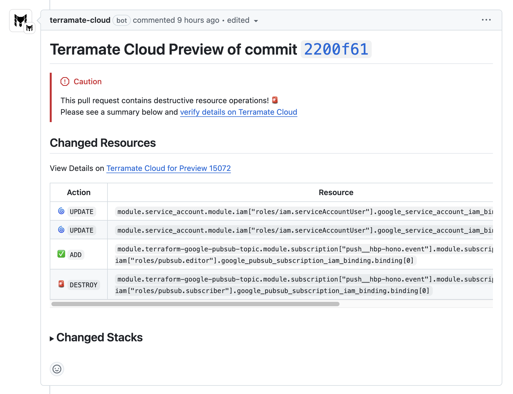

# Automating Terramate in GitHub Actions

GitHub Actions add continuous integration to GitHub repositories to automate your software builds, tests, and deployments. Automating Terraform with CI/CD enforces configuration best practices, promotes collaboration, and automates the Terraform workflow.

Terramate integrates seamlessly with GitHub Actions to automate and orchestrate IaC tools such as Terraform and OpenTofu.

::: tip
You can find a reference architecture to get started with Terramate, Terraform, AWS, and GitHub Actions in no time
at [terramate-quickstart-aws](https://github.com/terramate-io/terramate-quickstart-aws).
:::

::: info
Connect your GitHub user to your Terramate Cloud account to associate deployments triggered in GitHub Actions with your
Terramate Cloud user. Learn to link your accounts in the [account linking](../../../cloud/profile/account-linking.md) documentation.
:::

## Prerequisites

This part of the documentation focuses on setting up Terramate CLI with Terramate Cloud in GitHub Actions, which enables you to:

- Provide better summaries of change previews inside Pull Requests
- Provide details for each Pull Request in Terramate Cloud
- Detect and prevent security and vulnerability misconfigurations in Pull Requests using the built-in CIS Benchmark policies in Terramate Cloud

::: info
Automating Terramate CLI in GitHub Actions is technically possible without using Terramate Cloud. However, you will lose the ability to use rendered plan previews, policies, and all other Terramate Cloud-related features and instead provide ASCII plan previews only, which are capped at 65536 characters (~65 KB) only due to [a limitation in the GitHub Pull Request Comments API](https://github.com/orgs/community/discussions/27190).
Please see the CLI-only examples in the [blueprints](#terramate-blueprints) section for automating Terramate CLI without Terramate Cloud in GitHub Actions.
:::

### Install the Terramate GitHub App

It's recommended to install the [Terramate GitHub App](../../../cloud/integrations/github/index.md) in your GitHub organization
when automating GitHub in GitHub Actions. The app provides well-formatted previews of your IaC changes inside of Pull Requests
that are easy to understand. You can install the app via the integrations section in your Terramate Cloud account,
for details please see the [GitHub integration](../../../cloud/integrations/github/index.md) documentation.



### Configure GitHub Trust in your Terramate Cloud Organization

To allow Terramate CLI to sync data from GitHub Actions to Terramate Cloud, setting up OpenID Connect (OIDC) is required.
For that, you must configure the [GitHub Trust](../../../cloud/organization/settings.md#general-settings) in the settings
page of your Terramate Cloud Organization. This allows you to establish a trust relationship with GitHub Actions, which is
required to sync data from GitHub, and specify whether to sync the entire organization or a specific repository with
Terramate Cloud.

## Terramate Blueprints

This page explains workflows, required permissions, and authentication flows that the following workflows have in common.
To jump directly into the Blueprints, follow the links below:

- [Deployment Workflow Blueprints](./deployment-workflow.md)
- [Drift Check Workflow Blueprints](./drift-check-workflow.md)
- [Pull Request Preview Workflow Blueprints](./preview-workflow.md)

Please read the following sections to understand the details all those workflows have in common.

### Terraform Setup Action

::: warning

Ensure that you are not using the `terraform` wrapper when using the Terraform Setup GitHub Action provided by HashiCorp!

```
- uses: hashicorp/setup-terraform@v3
  with:
    terraform_wrapper: false
```
:::

To install Terraform using the [`hashicorp/setup-terraform`](https://github.com/hashicorp/setup-terraform) GitHub Action, you must disable the included wrapper.

The `terraform` wrapper script sets up outputs for follow-up GitHub Actions steps. The recommended method of using the [`terramate-io/terramate-action`](https://github.com/terramate-io/terramate-action) is through its own wrapper, which shares outputs and exit codes for subsequent actions.

As of version 3 - the latest at the point of writing this document - the wrapper got fixed to use the new GitHub APIs, but it has a bug that hides the detailed exit code required to synchronize the drift status to Terramate Cloud or other tools.

In addition, the outputs of the `terraform` wrapper will conflict for each execution of terraform when executing `terraform` in multiple stacks via `terramate run` or `terramate script run`.

### Workflow Permissions

To use password-less authentication with cloud providers and Terramate Cloud, ensure the GitHub Token used for the workflow has the necessary permissions. Additionally, when synchronizing with Terramate Cloud, `terramate` syncs details about the GitHub environment. This process requires Terramate to have permission to read pull-request details and checks.

- `id-token: write` Allow to create an OIDC TOKEN for exchange with Cloud Credentials and to authenticate to Terramate Cloud
- `contents: read` Allow to check the code from the repository
- `pull-requests: read` Allow to read pull request details
- `checks: read` Allow to read workflow details

Terramate Cloud synchronization provides visibility into deployment status and notifications via Slack for deployment failures or detected drifts during health checks. To enable this, expose the `GITHUB_TOKEN` environment variable to the commands synchronizing with Terramate Cloud.

### Merge and Apply Strategy

The GitHub Actions Workflow Blueprints use the merge+apply strategy, deploying changes when a pull request is merged into the `main` branch.

### Code Checkout

To enable Change Detection, add `fetch-depth: 0` to the `actions/checkout@v4` GitHub Action to ensure the git history is available for comparing commits.

### Cloud Authentication

Search for `CHANGEME` to update the required credential details for AWS and Google Cloud examples. The workflows use OpenID Connect (OIDC), a password-less method and the recommended way to authenticate to AWS and Google Cloud. Ensure the IAM Role on AWS or the Service Account on Google Cloud is configured for successful authentication.

- [Configuring OpenID Connect in Amazon Web Services](https://docs.github.com/en/actions/deployment/security-hardening-your-deployments/configuring-openid-connect-in-amazon-web-services)
- [Configuring OpenID Connect in Google Cloud](https://docs.github.com/en/actions/deployment/security-hardening-your-deployments/configuring-openid-connect-in-google-cloud-platform)
