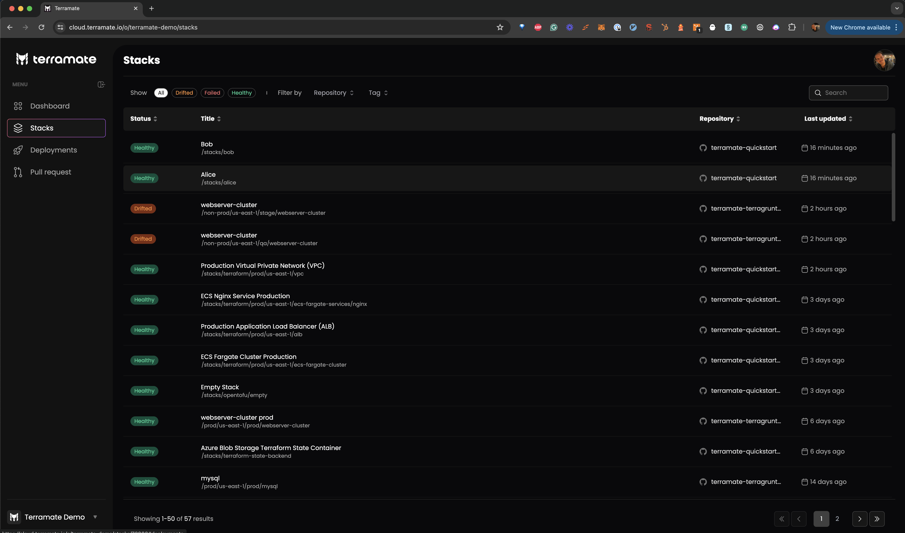
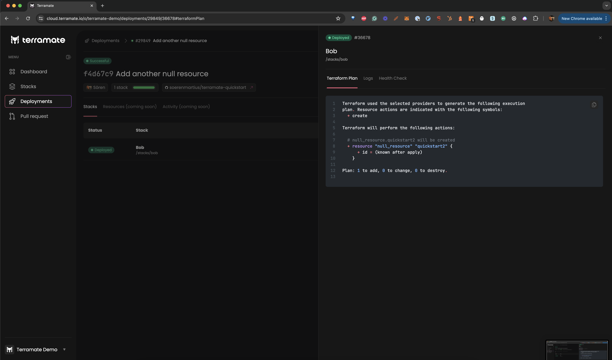

# Quickstart

In this guide, you will learn how to get started with Terramate from scratch by building a basic Terramate
project that manages Terraform or OpenTofu in stacks using the most essential Terramate features, such as **stacks**,
**code generation**, **orchestration**, and **change detection**.

<!-- NOTE: Add more tutorials over time -->

<!-- If you want to get an overview of what Terramate CLI is and how it works, please read the [introduction guide](../../index.md). -->

::: tip Terramate Community Discord Server
Join the ***[Terramate Community](https://terramate.io/discord)*** on Discord, the best place to ask questions and get
answers about Terramate and its ecosystem. Come aboard ⛵️🏴‍☠️
:::

<!-- If instead you want to learn how to use Terramate in an existing Terraform project, go here instead: -->

## Introduction

For a quick example of how Terramate works, this guide takes you through the following steps:

1. Creating a new Terramate project.
1. Adding stacks using Terramate CLI.
1. Generating a Terraform local backend configuration in all stacks using code generation.
1. Orchestrating commands such as `terraform plan` and `terraform apply` using orchestration and change detection.
1. Syncing all stacks to Terramate Cloud.

## Prerequisites

To start using Terramate, let's quickly run through some steps to ensure the correct setup of your environment.

### Install Terramate

::: code-group
```sh [macOS]
brew install terramate
```

```sh [Ubuntu & Debian]
# Add the Terramate repo to your sources
echo "deb [trusted=yes] https://repo.terramate.io/apt/ /" \
  | sudo tee /etc/apt/sources.list.d/terramate.list

apt update
apt install terramate
```

```sh [Fedora & CentOS]
# Add the Terramate repo to your sources
sudo tee /etc/yum.repos.d/terramate.repo <<EOF
[terramate]
name=Terramate Repository
baseurl=https://repo.terramate.io/yum/
enabled=1
gpgcheck=0
EOF

dnf install terramate
```

```sh [Windows]
# Download the binary from
https://github.com/terramate-io/terramate/releases
```
:::

Other installation options [are available](../installation.md#alternative-installation-methods). When the installation is complete, you can test it out by reading the current version:

```sh
$ terramate version
```

### Install Terraform or OpenTofu

Next, install Terraform or OpenTofu:

- [Install Terraform](https://developer.hashicorp.com/terraform/install)
- [Install OpenTofu](https://opentofu.org/docs/intro/install/)

## Create a new project

Terramate requires a git repository, and every git repository is a project in Terramate.

Let's create a new repository `terramate-quickstart` to set up your first Terramate project.

```sh
$ git init -b main terramate-quickstart
$ cd terramate-quickstart
```

New git repositories are empty per default and don't contain any commits. The change detection in Terramate works by detecting
changes between at least two commits. Let's add an initial, empty commit to the repository:

```sh
$ git commit --allow-empty -m "Initial empty commit"
```

## Create stacks

Now that the repository is ready, you can create your first stack. Stacks in Terramate are a collection of infrastructure
resources that you configure, provision, and manage as a unit.

We will give the stack an ***optional*** `name` and `description` upon creation to track the purpose and details of a stack.

Terramate will ensure that on creation, each stack gets an `id` set automatically if not defined by the user.

```sh
$ terramate create \
  --name "Alice" \
  --description "Alice's first stack" \
  stacks/alice
```

The `terramate create` command creates a file `stack.tm.hcl` containing a `stack {}` block to configure the stack, which will
look something like this.

```sh
$ cat stacks/alice/stack.tm.hcl

stack {
  name        = "Alice"
  description = "Alice's first stack"
  id          = "5b33e1c4-a3b0-477d-b0f1-add5918f764d"
}
```

::: info How does Terramate detect stacks?
Stacks in Terramate are identified by a directory that includes a `*.tm.hcl` file, which contains a `stack {}` block.
The file can have any name but the [terramate create](../cmdline/create.md) command always creates a file named `stack.tm.hcl`
:::

Next, let's check in our newly created stack to the repository:

```sh
$ git add stacks/alice/stack.tm.hcl
$ git commit -m "Create a first stack with Terramate"
```

To verify that Terramate is aware of the new stack, you can run [`terramate list`](../cmdline/list.md), which returns
a list of all stacks available in your project.

```sh
$ terramate list
stacks/alice
```

To create a second stack, we follow the same commands. First, we create the stack:

```sh
$ terramate create \
  --name "Bob" \
  --description "Bob's first stack" \
  stacks/bob
```

Next, we add the second stack to our repository:

```sh
$ git add stacks/bob/stack.tm.hcl
$ git commit -m "Create a second stack with Terramate"
```

To verify that Terramate is aware of both stacks, we can run [`terramate list`](../cmdline/list.md) again.

```sh
$ terramate list
stacks/alice
stacks/bob
```

## Change detection in action

Since we created our stacks step by step and created a git commit per stack, we can leverage
[change detection](../change-detection/index.md) to see what changes we introduced in our latest commit.

```sh
$ terramate list --changed
stacks/bob
```

By running the command mentioned above, you will see only the second stack is listed now, as we newly introduced the
second stack without changing the first stack. Terramate’s [change detection](../change-detection/index.md) is based on a
[Git integration](../change-detection/integrations/git.md) but also supports more integrations like
[Terraform](../change-detection/integrations/terraform.md) to detect affected stacks using a local Terraform Module
that has been updated outside of the stack.

## Code generation

Empty stacks are of not much use. One of Terramate’s primary use cases is orchestrating IaC tools such as Terraform and
generating code for it - but Terramate is not limited to Terraform and can also be used with other tooling such as
OpenTofu, Terragrunt, Kubernetes, Helm, CloudFormation, etc.

Every Terraform stack will need a backend configuration. For the sake of this guide, we will use the Terraform local backend.

To generate backend code we create a file called `stacks/backend.tm.hcl`:

::: code-group
```sh [Terraform]
$ cat <<EOF >stacks/backend.tm.hcl
generate_hcl "backend.tf" {
  content {
    terraform {
      backend "local" {}
    }
  }
}
EOF
```

```sh [OpenTofu]
$ cat <<EOF >stacks/backend.tm.hcl
generate_hcl "backend.tf" {
  content {
    terraform {
      backend "local" {}
    }
  }
}
EOF
```
:::

This configures Terramate to generate a `backend.tf` file in every stack it can reach within the `stacks/` directory. In this case, it applies to our `alice` and `bob` stacks.

To trigger the code generation we need to run the [`terramate generate`](../cmdline/generate.md) command:

```sh
$ terramate generate

Code generation report

Successes:

- /stacks/alice
  [+] backend.tf

- /stacks/bob
  [+] backend.tf

Hint: '+', '~' and '-' mean the file was created, changed and deleted, respectively.
```

The generation report will report any changes in the generated code.

Let’s commit the changes and generated code:

```sh
$ git add stacks
$ git commit -m 'Add a backend configuration to all stacks'
```

::: tip
It's a recommended best practice to check in generated code to your repository.
For details, please see [code generation best practices](../code-generation/index.md#best-practices).
:::

## Orchestration in action

The stacks created in the previous sections represent isolated environments, often referred
to as "root modules" in Terraform and OpenTofu. To make them functional, we must run `terraform init` or `tofu init`
in both. Terramate allows you to orchestrate any command in stacks using the [terramate run](../cmdline/run.md) command.

But before we can start, we need to prepare git to ignore temporary Terraform files by adding a `.gitignore` file, which is
located in the root directory of our repository:

```sh
# NOTE:
# You might not want to add state and lock file here
# This is just convenient when running the quickstart guide
$ cat <<EOF >.gitignore
.terraform
.terraform.lock.hcl
*.tfstate
terraform.tfstate
terraform.tfstate.backup
*.tfplan
EOF

$ git add .gitignore
$ git commit -m 'Add .gitignore'
```

Now let’s initialize our stacks:

::: code-group
```sh [Terraform]
$ terramate run terraform init
```

```sh [OpenTofu]
$ terramate run tofu init
```
:::

And run a Terraform plan:

::: code-group
```sh [Terraform]
$ terramate run terraform plan
```

```sh [OpenTofu]
$ terramate run tofu plan
```
:::

## Add Terraform resources

In this section, we create a Terraform [null resource](https://registry.terraform.io/providers/hashicorp/null/latest/docs/resources/resource.html)
for demonstration. Null Resources do not need to configure any cloud credentials as they do not create real
resources but only virtual ones.

This example will show:
- You can use plain Terraform config in any stack without using [code generation](../code-generation/index.md).
- Running only on changed stacks can save us time running and reviewing.

::: code-group
```sh [Terraform]
$ cat <<EOF >stacks/bob/null.tf
resource "null_resource" "quickstart" {
}
EOF

$ git add stacks/bob/null.tf
$ git commit -m "Add a null resource"
```

```sh [OpenTofu]
$ cat <<EOF >stacks/bob/null.tf
resource "null_resource" "quickstart" {
}
EOF

$ git add stacks/bob/null.tf
$ git commit -m "Add a null resource"
```
:::

To apply the changes, re-initialize Terraform and run `terraform apply` in the updated stacks.
As we only added the resource to the `bob` stack, we can leverage [change detection](../change-detection/index.md)
to run in the changed stack only.

Running commands only in stacks containing changes allows us to keep execution run times fast and blast radius small.

Re-initialize Terraform to download the null provider:

::: code-group
```sh [Terraform]
$ terramate run --changed terraform init
```

```sh [OpenTofu]
$ terramate run --changed tofu init
```
:::

Preview a plan:

::: code-group
```sh [Terraform]
terramate run --changed terraform plan
```

```sh [OpenTofu]
terramate run --changed tofu plan
```
:::

After reviewing the plan, we can apply the changes:

::: code-group
```sh [Terraform]
terramate run --changed terraform apply -auto-approve
```

```sh [OpenTofu]
terramate run --changed tofu apply -auto-approve
```
:::

When running the `terraform plan` again, we expect no changes to be planned anymore:

::: code-group
```sh [Terraform]
terramate run --changed terraform plan
```

```sh [OpenTofu]
terramate run --changed tofu plan
```
:::

## Connecting Terramate Cloud

Now that you have created your first Terramate project, let's connect it to Terramate Cloud and learn how we can enable
observability, CI/CD, drift detection, and more! Terramate CLI and Terramate Cloud work in tandem to deliver a reliable
experience. Terramate Cloud is free for individual use, with features available for teams.

### Create a cloud account

To start using the cloud, you need to sign up for a free cloud account and create an organization.

- Sign in and Sign up to [cloud.terramate.io](https://cloud.terramate.io) and
- Create your Organization

Remember the organization's short name that you set for accessing the organization on Terramate Cloud to configure your Terramate CLI in the next steps.

### Configure your repository

Configure your Terramate project to sync data to your Terramate Cloud organization after creating it.

```sh
$ cat <<EOF >terramate.tm.hcl
terramate {
  config {
    cloud {
      organization = "organization-short-name" # TODO: fill in your org short name
    }
  }
}
EOF

$ git add terramate.tm.hcl
$ git commit -m "Add Terramate Cloud configuration"
```

### Create a GitHub repository

Terramate Cloud requires a GitHub, GitLab, or BitBucket repository to work properly. We will use GitHub in this guide.
Let's start by [creating a new repository](https://github.com/new) in your personal GitHub account or an organization.
We'll name the repository `terramate-quickstart` and create it as a private repository.


Once the repository is created on GitHub, you can add it to your local repository and push your data to GitHub.
Don't forget to replace `your-account` with your GitHub account or organization handle.

```sh
$ git remote add origin git@github.com:your-account/terramate-quickstart.git
$ git branch -M main
$ git push -u origin main
```

## Login from CLI

To synchronize data from your local machine, you will need to `login` to Terramate Cloud from the CLI.
Terramate CLI will store a session on your machine after a successful login.

Use the following command to initiate the login.

```sh
$ terramate cloud login
```

If you want to login with GitHub instead, use:

```sh
$ terramate cloud login --github
```

## Sync stacks to Terramate Cloud

After setting up your GitHub repository and Terramate Cloud organization, let's sync the stacks configured in our Terramate
project to Terramate Cloud. The easiest to sync your stacks is to run a drift detection workflow in all stacks and sync
the result to Terramate Cloud:

::: code-group
```sh [Terraform]
$ terramate run \
  --sync-drift-status \
  --terraform-plan-file=drift.tfplan \
  --continue-on-error \
  -- \
  terraform plan -detailed-exitcode -out drift.tfplan
```

```sh [OpenTofu]
$ terramate run \
  --sync-drift-status \
  --tofu-plan-file=drift.tfplan \
  --continue-on-error \
  -- \
  tofu plan -detailed-exitcode -out drift.tfplan
```
:::

In a nutshell, the command above runs a `terraform plan` or `tofu plan` in all your stacks and sends the result to
Terramate Cloud. Since the plans don't detect any changes, Terramate Cloud won't mark those stacks as drifted but only
adds them to your inventory of stacks.



## Trigger a deployment

As a final step of this guide, we will change one of our stacks and trigger a new deployment. For that,
let's add another null resource to our `bob` stack.

::: code-group
```sh [Terraform]
$ cat <<EOF >>stacks/bob/null.tf
resource "null_resource" "quickstart2" {
}
EOF

$ git add stacks/bob/null.tf
$ git commit -m "Add another null resource"
```

```sh [OpenTofu]
$ cat <<EOF >>stacks/bob/null.tf
resource "null_resource" "quickstart2" {
}
EOF

$ git add stacks/bob/null.tf
$ git commit -m "Add another null resource"
$ git push origin main
```
:::

Next, plan and apply the changes. The following command will create a plan in all changed stacks and apply the generated
plan files and sync the result as a deployment to Terramate Cloud.

::: code-group
```sh [Terraform]
$ terramate run \
  --changed \
  -- \
  terraform plan -lock-timeout=5m -out deploy.tfplan

$ terramate run \
  --changed \
  --sync-deployment \
  --terraform-plan-file=deploy.tfplan \
  -- \
  terraform apply -input=false -auto-approve -lock-timeout=5m deploy.tfplan
```

```sh [OpenTofu]
$ terramate run \
  --changed \
  -- \
  tofu plan -lock-timeout=5m -out deploy.tfplan

$ terramate run \
  --changed \
  --sync-deployment \
  --tofu-plan-file=deploy.tfplan \
  -- \
  tofu apply -input=false -auto-approve -lock-timeout=5m deploy.tfplan
```
:::

A new deployment has started in Terramate Cloud. Check out the Deployments section to see it.



## Summary

We hope this tutorial has helped you grasp the basics of Terramate. Here's a summary of what we learned:

- How to initialize a Terramate Project in a Git repository.
- How to create [stacks](../stacks/index.md).
- How to leverage [change detection](../change-detection/index.md) when [managing stacks](../stacks/manage.md) or [running commands](../orchestration/run-commands-in-stacks.md).
- How to [generate code](../code-generation/index.md) in all stacks to keep the configuration DRY.
- How to deploy Terraform and OpenTofu using a local backend and [null resources](https://registry.terraform.io/providers/hashicorp/null/latest/docs/resources/resource.html) as an example.
- How to create a [Terramate Cloud](https://cloud.terramate.io) account and connect it to your project.

Those examples hopefully give you a starting point and help you get insights into the capabilities of Terramate.
This quickstart is just the tip of the iceberg. Running code generation and change detection can help you save a lot of time when maintaining or running Terraform.

## Next steps

- Configure CI/CD workflows for pull request previews, deployment, drift detection and reconciliation using GitHub Actions, GitLab, BitBucket pipeline or any other CI/CD platform.
- Configure Slack Notifications.
- Invite your team members to your organization.

## Join the community

If you have questions or feature requests regarding Terramate, we encourage you to join our
[Discord Community](https://terramate.io/discord) where we host regular events such as weekly Office hours.
It's an excellent place to contact our team and fellow community members if you have questions regarding Terramate.
Alternatively, you can also create an issue in the [Github repository](https://github.com/terramate-io/terramate).
