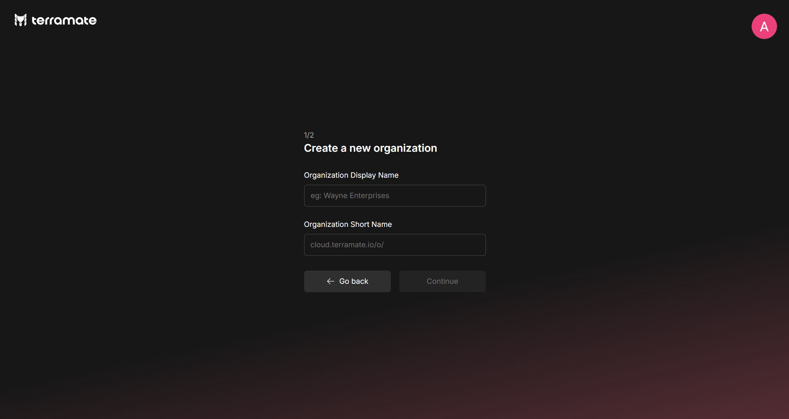
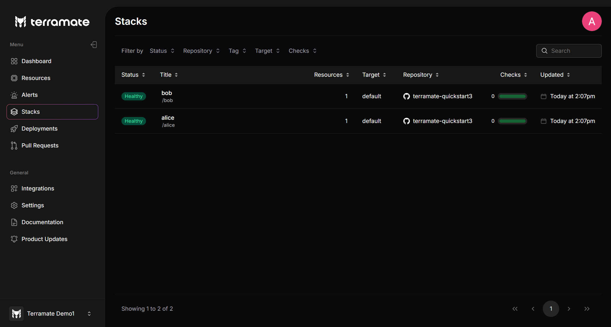

# Get started with Terramate and Terraform

This guide will teach you how to onboard Terramate to any existing Terraform repository in less than 5 minutes.

Here's what you will learn:
- Install Terramate CLI
- Onboard Terramate CLI to any Terraform repository
- Sign up for a free Terramate Cloud account
- Sync your stacks to Terramate Cloud

## 1: Install Terramate

Install the Terramate cli:

 ::: code-group
```sh [macOS]
brew install terramate
```

```sh [Ubuntu & Debian]
# Add the Terramate repo to your sources
echo "deb [trusted=yes] https://repo.terramate.io/apt/ /" \
  | sudo tee /etc/apt/sources.list.d/terramate.list

apt update
apt install terramate
```

```sh [Fedora & CentOS]
# Add the Terramate repo to your sources
sudo tee /etc/yum.repos.d/terramate.repo <<EOF
[terramate]
name=Terramate Repository
baseurl=https://repo.terramate.io/yum/
enabled=1
gpgcheck=0
EOF

dnf install terramate
```

```txt [Windows]
Download the binary from
https://github.com/terramate-io/terramate/releases
```
:::

For other installation methods, please see the [installation page](../installation.md).

## 2: Import Terraform root modules to Terramate

To enable Terramate CLI to interact with your Terraform configurations, you first need to import existing Terraform root modules (modules with a state backend configuration) as [Terramate stacks](../stacks/index.md), which can be done with the following command:

```bash
terramate create --all-terraform
```
This command creates a `stack.tm.hcl` file in every existing Terraform root module, enabling Terramate to consider the Terraform root modules as stacks. Those files are used to [configure](../stacks/configuration.md) the metadata such as `name`, `description`, `tags`, and optionally the [orchestration behavior](../../concepts/orchestration.md) of a stack.

For example, an existing Terraform project repo with two root modules:
```bash
.
├── alice
│   ├── main.tf
│   └── backend.tf
├── bob
│   ├── main.tf
│   └── backend.tf

``` 
After running the command, a `stack.tm.hcl` file is created in both root modules marking them as Terramate stacks:

```bash
.
├── alice
│   ├── main.tf
│   ├── stack.tm.hcl
│   └── backend.tf
├── bob
│   ├── main.tf
│   ├── stack.tm.hcl
│   └── backend.tf

```
## 3: Sign-up on Terramate Cloud:

When signing up to the platform at [cloud.terramate.io](https://cloud.terramate.io/), you are asked to choose a social login provider to sign in with.

Terramate Cloud offers to sign in using:

- A Google Workspace Account (formerly known as GSuite Account),
- A GitHub Account
- A Microsoft Entra ID Account


## 4: Create your Organization

 After you set up your profile, join an organization you were invited to or create your own. To create an organization, choose a display name and a short name. The short name appears in URLs (https://cloud.terramate.io/o/{short-name}) and in the Terramate CLI when you select an organization to sync or retrieve data from.

 You can belong to multiple organizations and teams. Click the “join” button to become an active member, then click “visit” to view your organization.



## 5: Configure your repository

Configure your Terramate project to sync data to your Terramate Cloud organization after creating it.

```bash
cat <<EOF >terramate.tm.hcl
terramate {
  config {
    cloud {
      organization = "organization-short-name" # TODO: fill in your org short name
    }
  }
}
EOF

git add terramate.tm.hcl
git commit -m "Add Terramate Cloud configuration"
```

## 6: Login from CLI

To synchronize data from your local machine, you will need to login to Terramate Cloud from the CLI. Terramate CLI will store a session on your machine after a successful login.

Use the following command to initiate the login.

```bash
terramate cloud login
```
If you want to login with GitHub instead, use:

```bash
terramate cloud login --github
```
## 7: Sync stacks to Terramate Cloud

After setting up your Terramate Cloud organization, let's sync the stacks configured in your Terraform project to Terramate Cloud. The easiest to sync your stacks is to run a drift detection workflow in all stacks and sync the result to Terramate Cloud:

```bash
terramate run \
  --sync-drift-status \
  --terraform-plan-file=drift.tfplan \
  --continue-on-error \
  -- \
  terraform plan -detailed-exitcode -out drift.tfplan
```
In a nutshell, the command above runs a `terraform plan` in all your stacks and sends the result to Terramate Cloud. Since the plans don't detect any changes, Terramate Cloud won't mark those stacks as drifted but only adds them to your inventory of stacks.



## 8: Next Steps

- [Setup CI/CD:](../automation/index.md) Manage your infrastructure using the recommended GitOps approach.
- [Slack Integration:](../../cloud/integrations/slack.md) Receive alerts in your Slack workspace by connecting it with Terramate Cloud.
- [Link Accounts:](../../cloud/profile/account-linking.md) Link different accounts with your Terramate Cloud profile for seamless infrastructure management
- [Terramate Community](https://terramate.io/discord): Join the Terramate Community on Discord to receive or contribute any help.