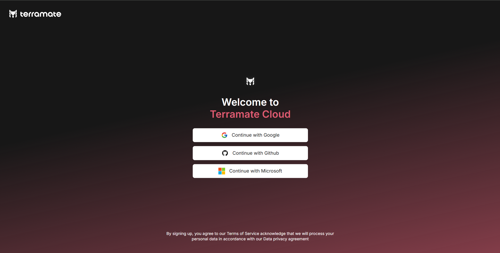
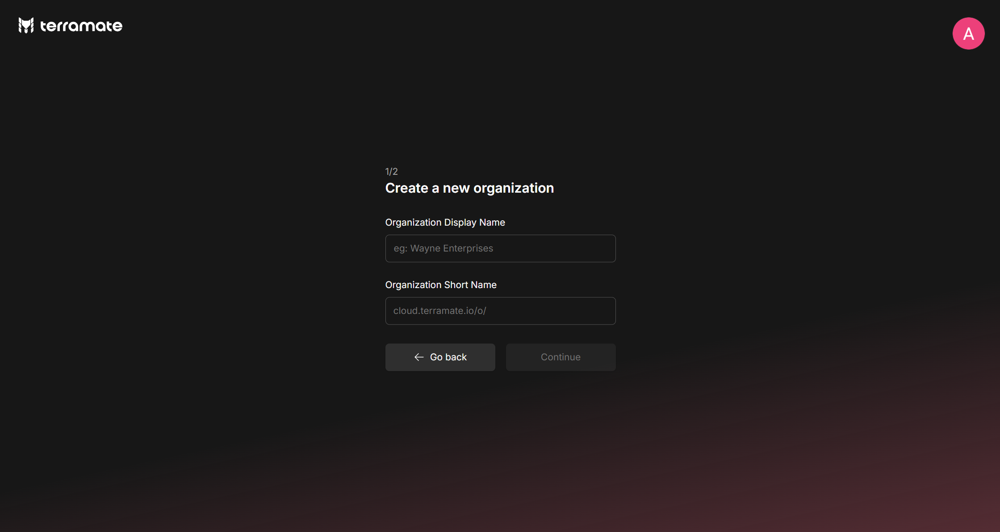
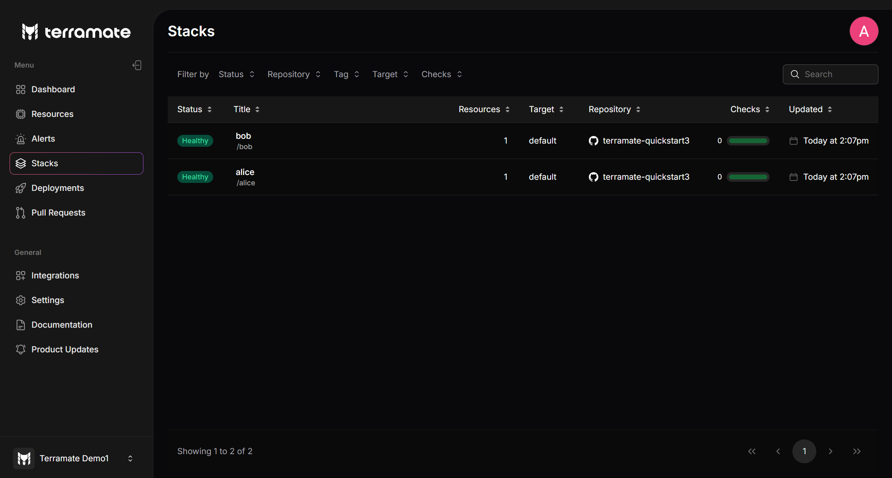

# Get started with Terramate and Terragrunt

This guide will teach you how to onboard Terramate to any existing Terragrunt repository in less than 5 minutes.

Here's what you will learn:
- Install Terramate CLI
- Onboard Terramate CLI to your Terragrunt repository
- Sign up for a free Terramate Cloud account
- Sync your stacks to Terramate Cloud

Let's get started!

::: info
To understand how Terramate can help supercharge existing Terragrunt projects with orchestration, change detection, drift detection, observability and more, take a look at our [Terramate and Terragrunt](https://terramate.io/rethinking-iac/how-terramate-adds-superpowers-to-terragrunt-in-just-5-minutes/) guide. To ask any questions, you can join our [Discord community](https://terramate.io/discord).
:::

## 1: Install Terramate CLI

Install the Terramate CLI:

 ::: code-group
```sh [macOS]
brew install terramate
```

```sh [Ubuntu & Debian]
# Add the Terramate repo to your sources
echo "deb [trusted=yes] https://repo.terramate.io/apt/ /" \
  | sudo tee /etc/apt/sources.list.d/terramate.list

apt update
apt install terramate
```

```sh [Fedora & CentOS]
# Add the Terramate repo to your sources
sudo tee /etc/yum.repos.d/terramate.repo <<EOF
[terramate]
name=Terramate Repository
baseurl=https://repo.terramate.io/yum/
enabled=1
gpgcheck=0
EOF

dnf install terramate
```

```txt [Windows]
Download the binary from
https://github.com/terramate-io/terramate/releases
```
:::

For other installation methods, please see the [installation page](../installation.md).

## 2: Import Terragrunt Modules

To enable Terramate CLI to interact with your Terragrunt configurations, you first need to import existing Terragrunt modules (modules with a state backend configuration) as Terramate stacks, which can be done with the following command:

```bash
terramate create --all-terragrunt
```
This command detects your existing Terragrunt modules, creates a stack configuration in each, and automatically sets up the order of execution using the `before` and `after` attributes based on detected Terragrunt dependencies.

## 3: Terramate Features for Terragrunt Repositories

All Terramate features are now available for your team, giving you the best of both worlds. Some of the key benefits include:

- **Orchestration with Change Detection:** run commands such as `terragrunt plan` and `terragrunt apply` in changed Terragrunt modules only, reducing run-times and blast radius and enabling parallelism.
- **GitOps automation workflows in GitHub Actions:** (or any other CI/CD) to automate Terragrunt with plan previews in Pull Requests in your CI/CD without requiring any additional tooling such as Atlantis.
- **Drift detection and reconciliation:** to keep your Terragrunt modules drift-free with scheduled workflows in GitHub actions.
- **Enhanced Monitoring:** Benefit from drift detection in all stacks, pull request previews for actual changes, notifications on deployment failures or new drifts, and advanced collaboration with alert routing.
- **Dual Workflow Support:** Operate Terragrunt and plain Terraform side-by-side.

## 4: Configure Change Detection Options

Terragrunt change detection is automatically enabled if your project contains any Terragrunt stack. You can customize this behavior by adding the configuration below to your `terramate.tm.hcl` file. For instance, to disable Terragrunt change detection, use:

```hcl
terramate {
  config {
    change_detection {
      terragrunt {
        enabled = "off"
      }
    }
  }
}
```
The valid options for `terramate.config.change_detection.terragrunt.enabled` are:

- `auto` (default): Enables change detection only if a Terragrunt stack is detected.
- `force`: Runs Terragrunt change detection at all times.
- `off`: Disables Terragrunt change detection.

## 5: Run Terragrunt Commands with Terramate

With Terramate orchestrating your Terragrunt workflows, the traditional `terragrunt run-all` command is no longer needed. Instead, use `terramate run -- terragrunt <cmd>` to execute commands within individual stacks. Here are some examples:

**List all Stacks**

```sh
terramate list
```
**Initialize Terraform with Terragrunt**

```sh
terramate run -- terragrunt init
```
**Create a Terraform Plan with Terragrunt in Parallel**

```sh
terramate run --parallel 5 -- terragrunt plan -out plan.tfplan
```
**Apply a Terraform Plan with Terragrunt in Changed Stacks**

```sh
terramate run --changed -- terragrunt apply -auto-approve plan.tfplan
```

## 6: Sign-up on Terramate Cloud:

Next, we'll sign up for a free Terramate Cloud account. You can use Terramate CLI to sync your stacks to Terramate Cloud
which provides an additional dashboard that adds features like observability, insights, asset management, stateful orchestration,
drift detection, alerts, and more to your Terramate projects.

When signing up to the platform at [cloud.terramate.io](https://cloud.terramate.io/), you are asked to choose a social login provider to sign in with.

Terramate Cloud offers to sign in using:

- A Google Workspace Account (formerly known as GSuite Account),
- A GitHub Account
- A Microsoft Entra ID Account



## 7: Create your Organization

After you set up your profile, join an organization you were invited to or create your own. To create an organization,
choose a display name and a short name. The short name appears in URLs (https://cloud.terramate.io/o/{short-name}) and
in the Terramate CLI when you select an organization to sync or retrieve data from.

You can belong to multiple organizations and teams. Click the “join” button to become an active member, then click
“visit” to view your organization.



## 8: Configure your repository

Configure your Terramate project to sync data to your Terramate Cloud organization after creating it.

::: code-group
```sh [Terramate EU]
$ cat <<EOF >terramate.tm.hcl
terramate {
  config {
    cloud {
      organization = "organization-short-name" # TODO: fill in your org short name
    }
  }
}
EOF

$ git add terramate.tm.hcl
$ git commit -m "Add Terramate Cloud configuration"
```

```sh{6} [Terramate US]
$ cat <<EOF >terramate.tm.hcl
terramate {
  config {
    cloud {
      organization = "organization-short-name" # TODO: fill in your org short name
      location     = "us"
    }
  }
}
EOF

$ git add terramate.tm.hcl
$ git commit -m "Add Terramate Cloud configuration"
```
:::

## 9: Login from CLI

To synchronize data from your local machine, you will need to login to Terramate Cloud from the CLI.
Terramate CLI will store a session on your machine after a successful login.

Use the following command to initiate the login.

```bash
terramate cloud login
```
If you want to login with GitHub instead, use:

```bash
terramate cloud login --github
```
## 10: Sync stacks to Terramate Cloud

After setting up your Terramate Cloud organization, let's sync the stacks configured in your repository to Terramate Cloud.
The easiest way to sync your stacks is to run a drift detection workflow in all stacks and sync the result to Terramate Cloud:

```bash
terramate run \
  --continue-on-error \
  --cloud-sync-drift-status \
  --terraform-plan-file=drift.tfplan \
  --terragrunt \
  -- terragrunt plan -out drift.tfplan -detailed-exitcode -lock=false
```

In a nutshell, the command above runs a `terragrunt plan` in all your stacks and sends the result to Terramate Cloud.

::: info
This works because Terramate CLI extracts data such as metadata, resources, Git metadata, and more from the created plans
and the environment in which it's running, sanitizes it locally and syncs the result to Terramate Cloud. This makes
Terramate extremely secure since no sensitive information, such as credentials or certificates, will ever be synced to
Terramate Cloud.
:::

If the plans don't contain any changes, Terramate will simply create an inventory of all infrastructure configured in
Terramate Cloud. If the plans changes, Terramate will additionally create drift alerts.



And that's it. You just learned how to onboard Terramate to your Terragrunt repository in less than 5 minutes.
Next, you can onboard your CI/CD platform by using our [CI/CD pipeline workflows](../automation/index.md).

## 11: Next Steps

- [Setup CI/CD:](../automation/index.md) Configure your CI/CD to sync pull requests previews, deployments and automated drift detection workflows.
- [Slack Integration:](../../cloud/integrations/slack.md) Receive alerts and notifications in Slack.
- [Link Accounts:](../../cloud/profile/account-linking.md) Link different accounts such as GitHub or GitLab with your Terramate Cloud profile to enable auto-assignment for alerts.
- [Terramate Community](https://terramate.io/discord): Join the Terramate Community on Discord to receive or contribute any help.
