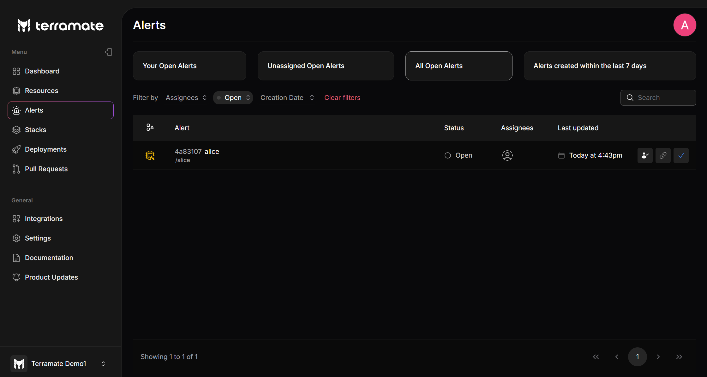
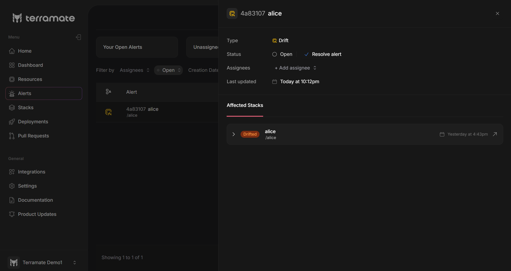
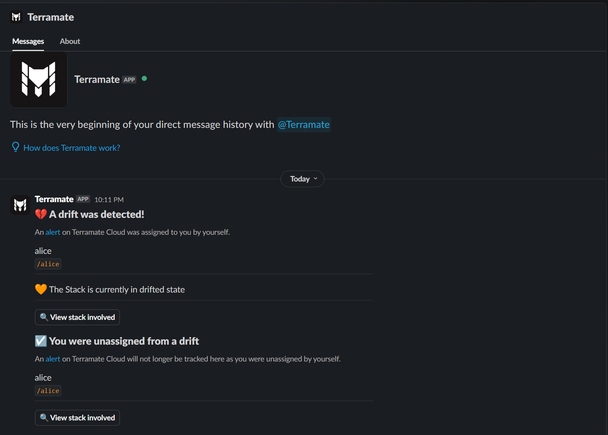

# Managing Incidents with Alerts

Terramate Cloud alerts help manage critical events, such as failed deployments and detected drift. Alerts are automatically generated for these events and assigned to the appropriate individuals or teams (for example, the author of a commit or Pull Request).

Alerts seamlessly integrate with Slack via the [Terramate App for Slack](../integrations/slack.md) integration, sending direct messages to assigned recipients whenever alerts are created or updated.

::: info
Unless a member of your Terramate Cloud organization uses the same email address among all their third-party accounts
(e.g., GitHub user, GitLab user, Slack user, etc.), users must link their accounts with their Terramate Cloud user in the
profile section. Otherwise, Terramate cannot automatically assign alerts because of the lack of mapping, e.g., for
GitHub and Slack users.

Linking accounts can be done in the [user profile](../profile/index.md).
Learn more about this in the [account linking](../profile/account-linking.md) documentation.
:::

## Alert List

The Alert Dashboard displays all alerts—both resolved and unresolved—across the organization. In the list view, each alert includes:

- **Alert Type**: The alert's [category](./index.md#types-of-alerts)
- **Stack Name**: The stack name and commit ID that triggered the drift.
- **Status**: The current state of the alert (`open` or `resolved`).
- **Assignees**: Team members assigned to the alert.
- **Last Updated**: Timestamp of the most recent action.
- **Action Buttons**: Direct controls for each alert:
  - **Take Ownership**: Assign the alert to yourself (triggers a Slack notification for assignees).
  - **Share Link**: Share the alert with your team.
  - **Resolve**: Mark the alert as resolved (triggers a Slack notification for assignees).

## Alert Details

This view allows you to inspect detailed alert information and take the following actions:

- **Assignees**: Add or remove assignees beyond the default auto-assignees.
- **Resolve Alert**: Mark the alert as resolved (assignees receive a Slack notification). Alerts automatically resolve when the corresponding stack becomes [healthy](../stacks/status.md#healthy).
- **Visit Stack Details**: Access detailed information about the associated stack.

## Types of Alerts

Currently, Terramate Cloud automatically creates, assigns and resolves alerts for the following incidents:

### Failed Deployment

A failed deployment in Terramate describes a deployment that contains one or multiple failed stacks.
Alerts for failed deployments will be automatically assigned to several individuals:

- Author of the Pull Requests from which the failed deployment originated.
- All reviewers of the Pull Requests from which the failed deployment originated.
- The person who triggered the deployment by merging the origin Pull Requests or triggering a local deployment.

### Detected Drift

A detected drift in Terramate describes a stack that has drifted.
Alerts for drifted stacks will be automatically assigned to several individuals:

- The person who triggered the last deployment (merging the latest Pull Requests or triggering a local deployment).

## Auto Resolving of Alerts

Whenever the underlying root issue that causes an alert in the first place gets resolved, alerts are resolved automatically.
For example, let's assume that drift has been introduced for a stack and an alert has been created during a scheduled
drift detection run. If the drift is resolved (e.g., by someone logging in to the AWS console and remediating the drift)
during the next scheduled drift detection run, the alert will be resolved automatically.

## Integrating Alerts with Slack

To integrate alerts with your Slack workspace, [install the Terramate App for Slack](../integrations/slack.md). Once installed, the
App for Slack will send notifications for all newly created and updated alerts to all assigned users. Users will be able to
open alerts and affected stacks directly from Slack.

