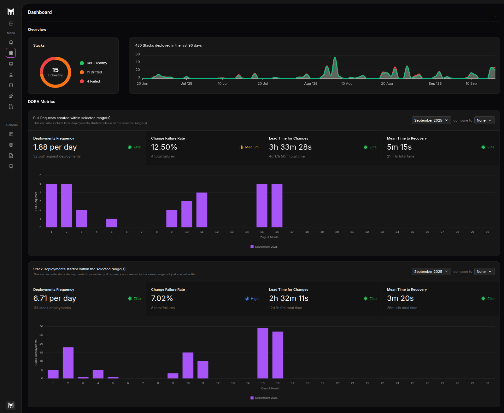

# Dashboard

The dashboard gives your organization a high-level, real-time view of stack health, deployment activity, and engineering performance metrics. It is organized into two main areas: **Overview** and **DORA Metrics**.

## Overview

The Overview section summarizes the current state of your infrastructure and historical activity at a glance.

### Health donut

The health donut shows the current number of stacks by status:
- `Healthy`: Stacks with no detected drifts and no recent failed deployments
- `Drifted`: Stacks where the live state deviates from the configuration
- `Failed`: Stacks for which the latest deployment failed

If no stacks are unhealthy, the donut collapses to a single healthy count.

### Stacks deployed in the last 90 days

A time-series chart shows the number of stacks deployed each day over the last 90 days. The chart distinguishes:
- Successful deployments (green)
- Failed deployments (red)

Use this graph to quickly spot spikes in activity and correlate them with failure trends.

## DORA Metrics

The DORA Metrics area presents engineering performance across two complementary lenses with the same set of four metrics:
- **Deployment Frequency**
- **Change Failure Rate**
- **Lead Time for Changes**
- **Mean Time to Recovery (MTTR)**

Each metric displays a value, a ranking indicator badge (e.g., Elite/High/Medium/Low), and a detailed visualization.

### Ranking thresholds (DORA)

The ranking shown for each metric follows these thresholds:
- **Deployment frequency**
  - Elite: At least once per day
  - High: At least once per week
  - Medium: At least once per month
  - Low: Less than once per month
- **Change failure rate**
  - Elite: ≤ 5%
  - High: ≤ 10%
  - Medium: ≤ 30%
  - Low: > 30%
- **Lead time for change**
  - Elite: ≤ 24 hours
  - High: ≤ 7 days
  - Medium: ≤ 30 days
  - Low: > 30 days
- **Mean time to recovery**
  - Elite: ≤ 1 hour
  - High: ≤ 24 hours
  - Medium: ≤ 7 days
  - Low: > 7 days

### Pull Request activity (selected range)

This panel aggregates metrics computed from pull requests that fall within the selected time range. It helps you understand how quickly changes move through review and how often they cause failures when merged.

- Deployment Frequency: Average number of PRs merged per day
- Change Failure Rate: Percentage of PRs that led to a failed deployment
- Lead Time for Changes: Average time from PR creation to successful deployment
- Mean Time to Recovery: Average time from a failure to the restoring deployment

A bar visualization summarizes the distribution and highlights the current DORA rating.

### Stack deployments started (selected range)

This panel aggregates metrics computed from stack deployments that started within the selected time range. It focuses on operational outcomes, independent of PR counts.

- Deployment Frequency: Average number of stack deployments per day
- Change Failure Rate: Percentage of failed deployments
- Lead Time for Changes: Average time from change ready (merge) to deployment completion
- Mean Time to Recovery: Average time from failure to subsequent successful deployment

Visualizations emphasize the distribution of outcomes and highlight the current DORA rating.

## Filters and comparisons

- **Time range selector**: Choose a period (e.g., a specific month) to scope the metrics and visualizations.
- **Compare to**: Optionally compare the selected period to a previous period to spot improvements or regressions.

All charts and metrics on the page respect the selected filters.

## Tips

- Run **scheduled drift checks** and **synchronize all PRs and deployments** to Terramate Cloud to keep health and DORA metrics accurate.
- Interpret **PR vs. Stack Deployments** panels together: PR metrics capture development flow efficiency; deployment metrics capture operational reliability. Improving one without the other can reveal bottlenecks.
- **Lead Time for Changes** improvements without a corresponding **Change Failure Rate** drop may indicate a focus on faster releases with lower quality.
- **Change Failure Rate**: Sustained values above 10% warrant investigation. Values above 30% typically signal systemic quality or testing gaps.
- Use **Compare to** to validate change impact (e.g., new pipeline, policy changes). Favor improvements that persist across multiple periods, not just one-time spikes.
- Watch for **outliers**: a single failure can skew MTTR for small sample sizes—use the activity chart and counts to contextualize the period.
