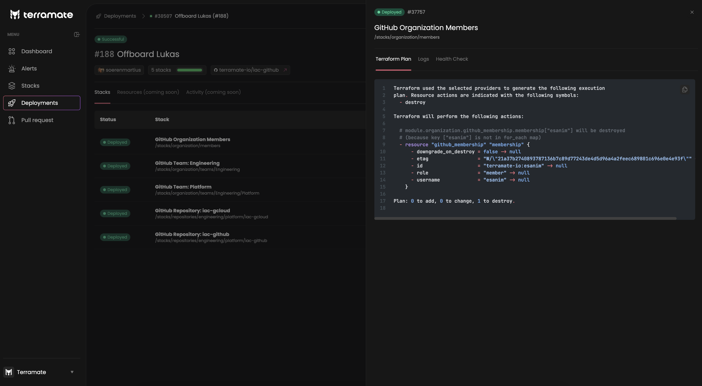

# Deployments

This section explains **deployments** as a core concept in Terramate.

## Introduction

Deployments in the context of Infrastructure as Code (IaC) are a process that groups various activities to provision
and decommission infrastructure resources that are defined in code to the cloud or other providers.

Terramate Cloud keeps track of all activities related to the full deployment life-cycle, the outcome of such activities,
notifies and alerts about anomalies and failures, and provides full audibility (search, filter, browse) of historic
changes.

Terramate CLI orchestrates all related activities (such as `terraform apply`) and synchronizes details to
Terramate Cloud from various sources (e.g. multiple stacks, repositories, or CI/CD environments - even manual execution)
and over multiple technologies (e.g. Terraform, OpenTofu, CloudFormation, Pulumi) and for multiple providers
(e.g. AWS, Google Cloud, Azure).

