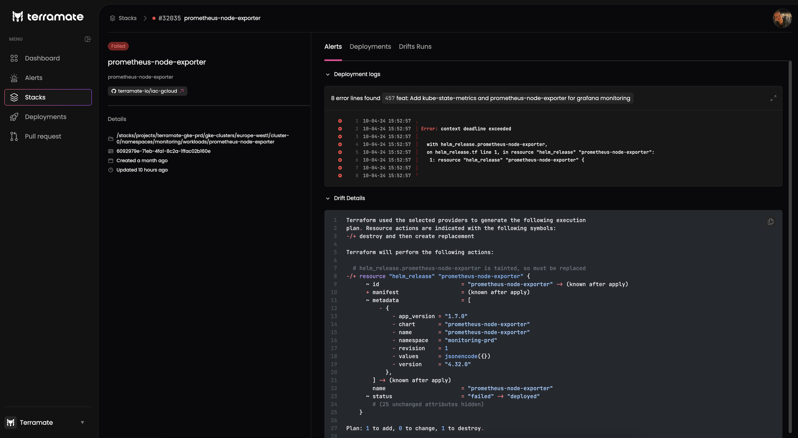

# Drift Management

This section explains **drift** as a core concept in Terramate.

## Introduction

Drift means that your Terraform code no longer represents your provisioned infrastructure, meaning that the infrastructure
diverges from your configuration.

Terramate helps you to detect drift by periodically running drift detection workflows in your CI/CD such as GitHub Actions, GitLab CI/CD or BitBucket pipelines. Upon detection of drift in stacks, Terramate will sync those drift to Terramate Cloud allowing
you to identify and manage drift

## Types of Drift Detection

Terramate currently supports two types of drift detection:

- **Post-deployment drift detection** You can use Terramate to run a drift detection immediately after a deployment
to understand if resources in stacks drift right away.
- **Scheduled drift detection:** You can use Terramate to run scheduled drift detection workflows for all stacks managed
in a repository or specific directories or stacks by using filters. This allows you to configure more frequent drift
detection workflows for specific environments and services.

## Alerts

Terramate can create actionable alerts for drifted stacks that notify an owner or a group of owners of stacks.
In addition, notifications can be sent to a centralized Slack channel or directly to Slack users by using our Slack app.

## Drift Reconciliation

Terramate allows you to enable automated reconciliation as it ensures that you get the most out of drift detection.
Reconciliation jobs run in your CI/CD using configurable intervals. In addition, you can configure specific stacks to be
considered for reconciliation only by e.g. using a tag-based approach.
