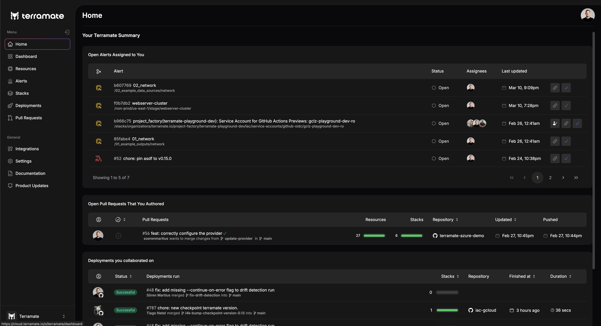

# Home Page

The Home page provides a summary of your engagements in Terramate Cloud, including:

- **Alerts**: Open alerts assigned to you.
- **Pull Requests**: Open pull requests authored by you.
- **Deployments**: Deployments in which you collaborated.

## Alerts

The Alerts list displays details of alerts assigned to you, following the same layout as the [Alerts dashboard](../alerts/index.md).

## Pull Requests

The Pull Requests list shows [pull requests](../previews/index.md) you authored in repositories associated with your Terramate Cloud organization.

## Deployments

The Deployments list presents deployments where you contributed by pushing commits. The list shows:

- **Status**: The current state of each deployment.
- **Triggering Pull Request and Metadata**: Displays the pull request that initiated the deployment, including its title, the author's name, and the branch where it was merged.
- **Associated Stack**: The stack linked to the deployment.
- **Associated Repository**: The repository containing the deployment's code.
- **Finished At**: A timestamp indicating how long ago the deployment completed.
- **Duration**: The total run time of the deployment.