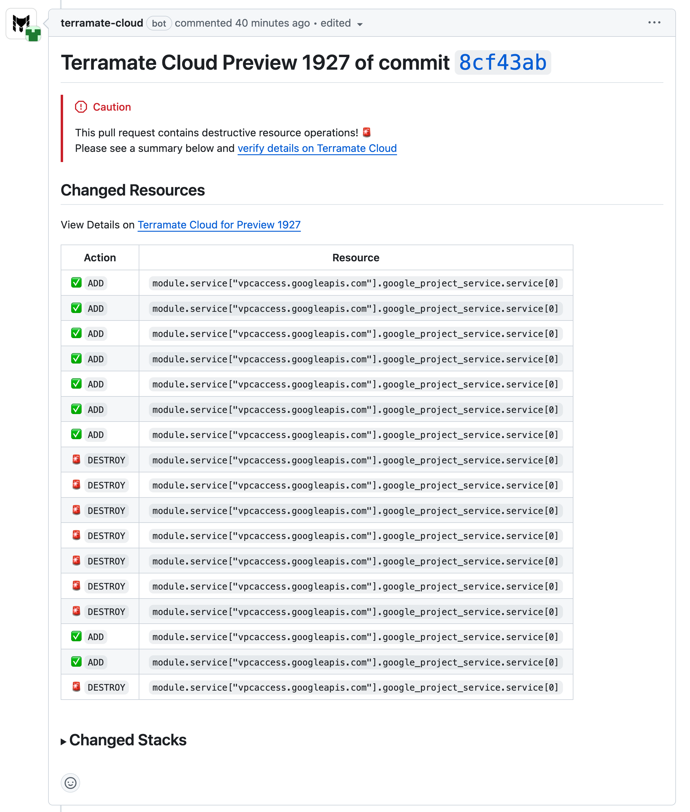
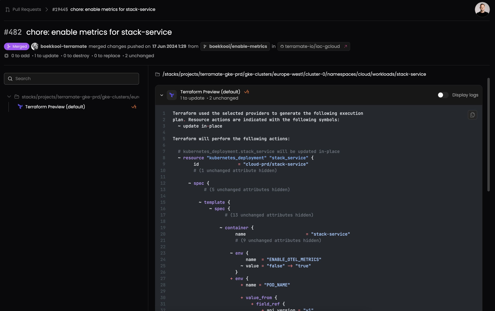
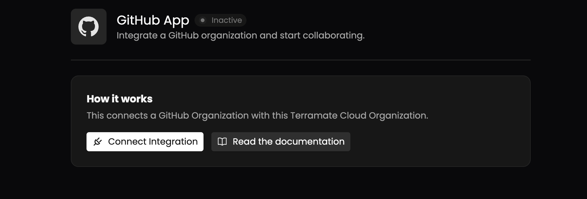
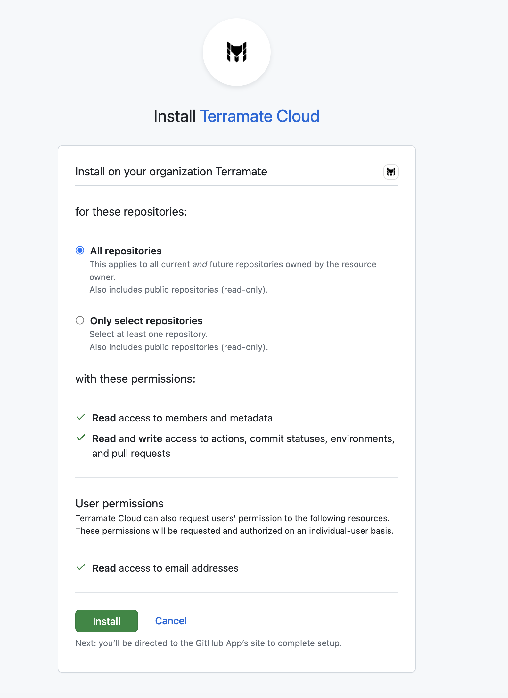
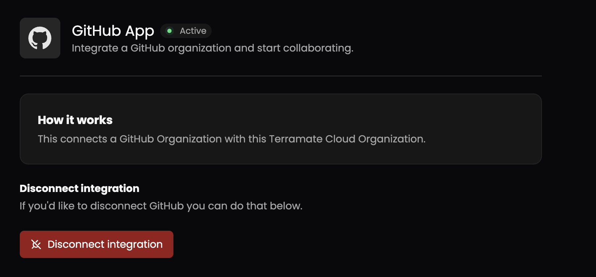

# GitHub Integration

Terramate Cloud integrates with GitHub by providing a [GitHub App](https://github.com/apps/terramate-cloud) that
can be installed in your personal GitHub account or your GitHub organization. Installing our GitHub App allows you to
use features such as **rendered plan previews** in Pull Requests, automated **Pull Request approvals**,
**status checks**, **policies**, and more.

## Features

Using the GitHub App to integrate Terramate Cloud and GitHub enables several features:

### Rendered Plans

For every new plan preview created with Terramate CLI, the GitHub App will provide a rendered version of each plan
inside Pull Requests, clearly highlighting destructive changes. This allows your team to better understand changes introduced
in Pull Requests without having to understand complex Terraform and OpenTofu plans.

Each rendered comes with a link to the Pull Request preview in Terramate Cloud,  allowing you to see the ASCII Plan, logs
from GitHub Actions and more.

## Setting up the integration

To install the GitHub App, please navigate to the integrations page of your Terramate Cloud organization and click on
the ***GitHub App*** in the ***available integrations*** section to start the installation process.

Next, you will be able to see the details of the GitHub App integration.

By pressing the ***Connect Integration*** button, you will be forwarded to GitHub.
Please choose your GitHub Organization or personal account to connect Terramate Cloud to and select whether to connect
Terramate Cloud to all or a selected range of repositories.

That's it! Terramate Cloud will now listen to incoming events from GitHub and enrich your Pull Requests with rendered plans,
status checks and more.

## Uninstall the GitHub App Integration

To uninstall the GitHub App, navigate to the integration page in your Terramate Cloud account and open the GitHub App
integration page.

Pressing the ***Disconnect Integration*** will forward you to the app settings page of your personal or organizational GitHub account. Press ***Uninstall*** to remove the Terramate Cloud GitHub App and to unlink GitHub and Terramate Cloud.
