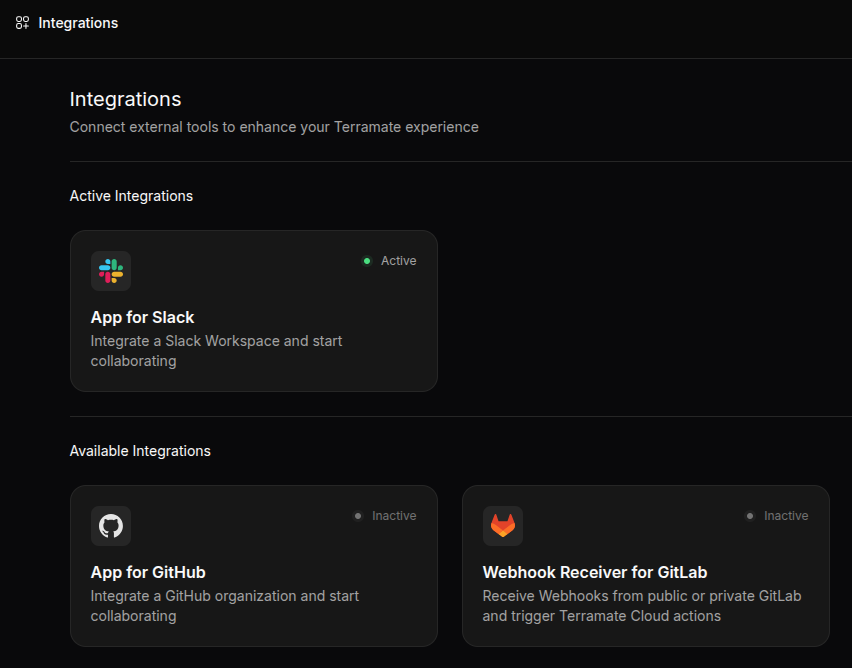

# Integration with Slack

Terramate Cloud integrates with Slack by providing an App for Slack that can be installed in your Slack workspace.
Installing our App for Slack allows you to use:

- Use the Terramate Slack bot to interact with Terramate Cloud directly from your Slack Workspace.
- Integrate [alerts](../alerts/index.md) with your Slack Workspace.
- Send notifications to individuals and teams directly in Slack instead of just sharing notifications in a single Slack
  channel for more actionable notifications.

## Setting up the integration

To install the App for Slack, please navigate to the integrations page of your Terramate Cloud organization and click on
the App for Slack in the available integrations section to start the installation process.

Next, you will be able to see the details of the App for Slack.

By clicking ***Connect Integration***, you will be forwarded to Slack.
Please choose your Slack Workspace in which you want to install the App for Slack.

As a final step, allow the App for Slack to connect to your workspace.

That's it, Terramate is now installed in your Slack Workspace and you should be able to use the Terramate App directly
from within Slack.

<!-- ## Uninstalling the integration -->
