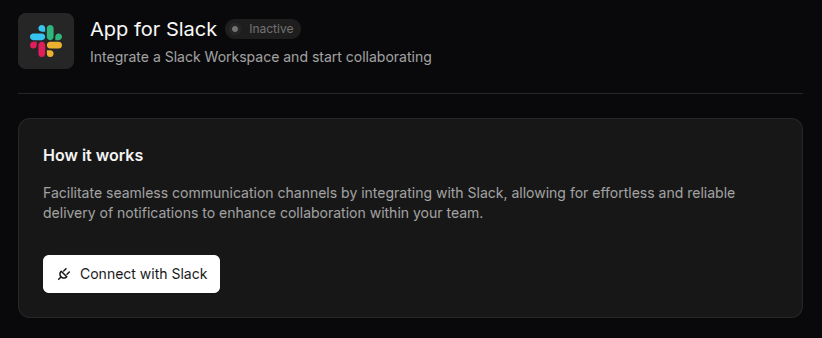

# Slack Integration

Terramate Cloud integrates with Slack by providing a Slack App that can be installed in your Slack workspace.
Installing our Slack App allows you to use:

- Use the Terramate Slack bot to interact with Terramate Cloud directly from your Slack Workspace.
- Integrate [alerts](../alerts/index.md) with your Slack Workspace.
- Send notifications to individuals and teams directly in Slack instead of just sharing notifications in a single Slack
  channel for more actionable notifications.

## Setting up the integration

To install the Slack App, please navigate to the integrations page of your Terramate Cloud organization and click on
the Slack App in the available integrations section to start the installation process.

Next, you will be able to see the details of the Slack App integration.

By clicking ***Connect Integration***, you will be forwarded to Slack.
Please choose your Slack Workspace in which you want to install the Slack App.

As a final step, allow the Slack App to connect to your workspace.

That's it, Terramate is now installed in your Slack Workspace and you should be able to use the Terramate App directly
from within Slack.

<!-- ## Uninstalling the integration -->
