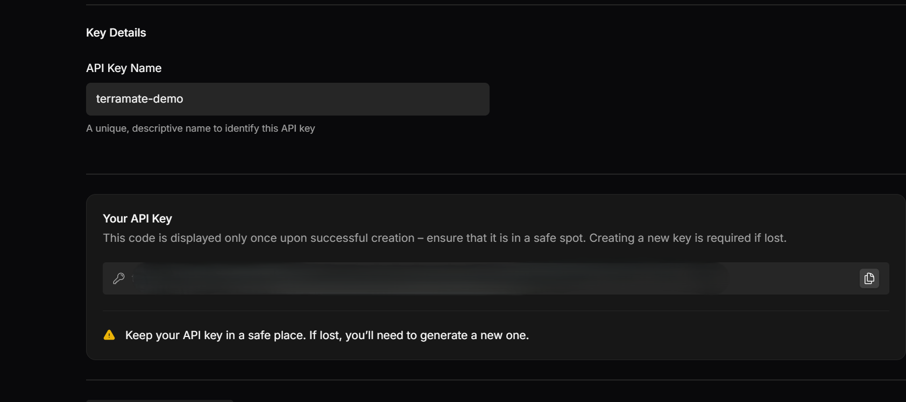

# Create and manage API keys

If you are an organization admin, you can create and manage API keys for use with the Terramate CLI or to interact with the Terramate Cloud API.

## How to create an API key

::: info
When you create an API key, Terramate Cloud will only display the key only once upon successful creation – ensure that it is in a safe spot.
Creating a new key is required if lost.
:::

To create an API key:
1. Navigate to the **API Keys** section in the sidebar of the **Settings** page of your Terramate Cloud dashboard.
2. Click on the **Create API Key** button.

3. Provide a name or label for the key to identify its purpose.

4. Confirm the action. The API key will be generated and displayed.

5. Save the key securely as it will not be shown again.

## Managing API Keys

Only organization admins have the ability to manage API keys. This includes actions such as:
- Viewing a list of active API keys.
- Deleting API keys no longer in use( click on the delete icon adjacent to an api key ).
- Generating new keys when needed( click on **Create Api Key** ).