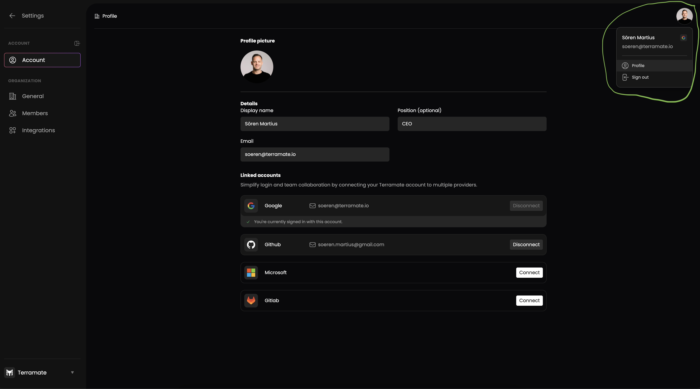

# Profile Section

This section guides you on managing your Terramate Cloud user and profile.

In the profile section, you can configure your settings and [link additional accounts](./account-linking.md), such as GitHub, GitLab, Microsoft, and Google.

To access the profile section, click on your profile picture in the top right corner of the navbar and follow the profile link.

## Manage Personal Information

The following information is available for you to manage in the profile section:

- Full name
- Position

::: info
Note that you can't update your email address, since it's automatically synced from the identity provider used to create your Terramate Cloud account.
:::
