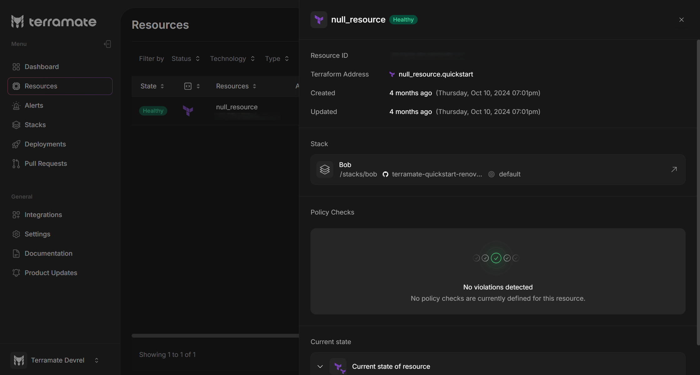

# Resource Details

On the Resource Details page, you can view the following details about the selected resource:
- `Resource ID`: The unique identifier for the resource in Terramate Cloud.
- `Terraform Address`: a string that uniquely identifies a specific resource instance within your Terraform configuration
- `Created`: The date and time the resource was added to Terramate Cloud.
- `Updated`: The date and time the resource was last updated.
- `Stack`: The stack that includes this resource. Clicking this section directs you to its details on the Stacks Details page.
- `Repository`: The repository that contains the stack associated with the selected resource.
- `Target`: The environment or module where the resource is deployed.
- `Policy Checks`: The policy validations executed against the resource.
- `Current State of resource`: Displays the resource's attributes, combining those set by the infrastructure (e.g., a Google Cloud bucket's self_link) with those defined in your code (e.g., the bucket's name).

