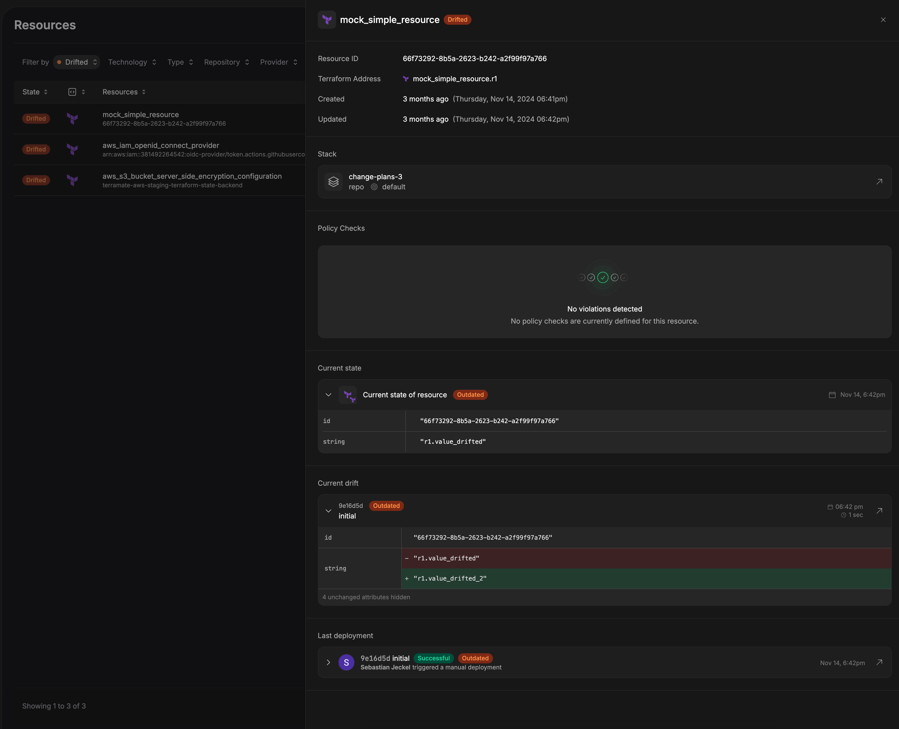

# Resource Details

On the Resource Details page, you can view key metadata that helps you track, manage, and troubleshoot your infrastructure. Each data point provides actionable insights:
- `Resource ID`: A unique identifier consistently tracks the resource across Terramate Cloud.
- `Terraform Address`: Links the resource to its Terraform configuration, making it easy to locate and manage in your code.
- `Created Time`: The timestamp when the resource was added, useful for auditing its lifecycle.
- `Updated Time`: The timestamp of the last status update helps you monitor recent changes.
- `Stack`: Identifies the stack that includes this resource; clicking it navigates to the stack details page.
- `Repository`: Displays the repository containing the resource, connecting it to its source code and history.
- `Target`: Specifies the environment where the resource is deployed, clarifying its role.
- `Policy Checks`: Lists the policy checks applied to the resource to ensure it meets your organization’s standards.
- `Current State`: Displays the resource's attributes, combining those set by the infrastructure (e.g., a Google Cloud bucket's self_link) with those defined in your code (e.g., the bucket's name). It's marked as `Outdated` if the last deployment has newer planned changes.
- `Current drift`: Displays any differences between the deployed state and the desired configuration. It is marked as `Outdated` if there is a newer deployment.
- `Last Deployment`: Displays the most recent deployment details, including the user who initiated it and whether it was triggered manually. It is marked as `Outdated` if the current state is newer.
- `Outdated Tag`: Flags the resource if its metadata is not current, indicating that a new deployment or drift check may be needed.

