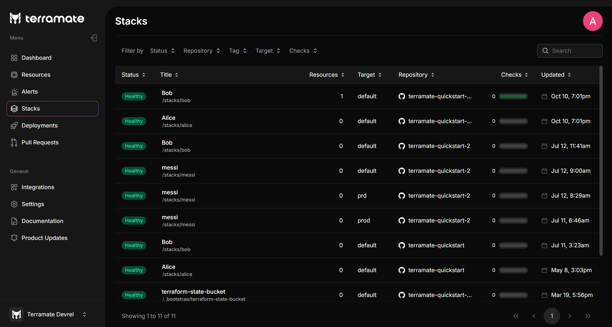

# Stack Inventory

The stack inventory helps you to keep an overview of all stacks managed with Terramate.

::: tip
To learn more about stacks in Terramate, please read [an introduction to Stacks](../../cli/stacks/index.md).
:::

Stacks can be created, configured and managed with [Terramate CLI](../../cli/stacks/create.md) and are located in a
_repository_ on [GitHub](../../cli/automation/github-actions/index.md), [GitLab](../../cli/automation/gitlab-ci/index.md), [BitBucket](../../cli/automation/bitbucket-pipelines/index.md) or any other supported VCS provider. As a stack within a _repository_ is only
plain code and configuration, you can use Terramate CLI to sync the status of your stacks to Terramate Cloud.
This allows you to keep track of all orchestrated operations such as previews, deployments, and drift runs and also provides
in-detail observability, such as resources managed in stacks, costs, policy violations and more!

In addition, the stack inventory is not limited to single stacks or single repositories but combines all stacks in all your
organization's repositories in a central place.

Each stack can be `healthy` or `unhealthy` (e.g. `failed` or `drifted`) depending on the result of [deployments](../deployments/index.md)
or [drift runs](../drift/index.md).

## Filter Options:

- Status: Filter stacks by their current state:
    - [Healthy](./status.md#healthy): The stack is deployed successfully, and does not have any detected drifts.
    - [Failed](./status.md#failed): The stack has failed to deploy the planned changes.
    - [Drifted](./status.md#drifted): The stack has differences between the desired configuration(code) and applied configuration(cloud).
- Repository: Filter stacks by the repository that contains them.
- Tag: Filter stacks by their [tags](../../cli/stacks/configuration.md#tags)
- Target: Filter stacks by the target environment where they are deployed.
- Checks: Filter stacks by the result of policy checks executed against them.
