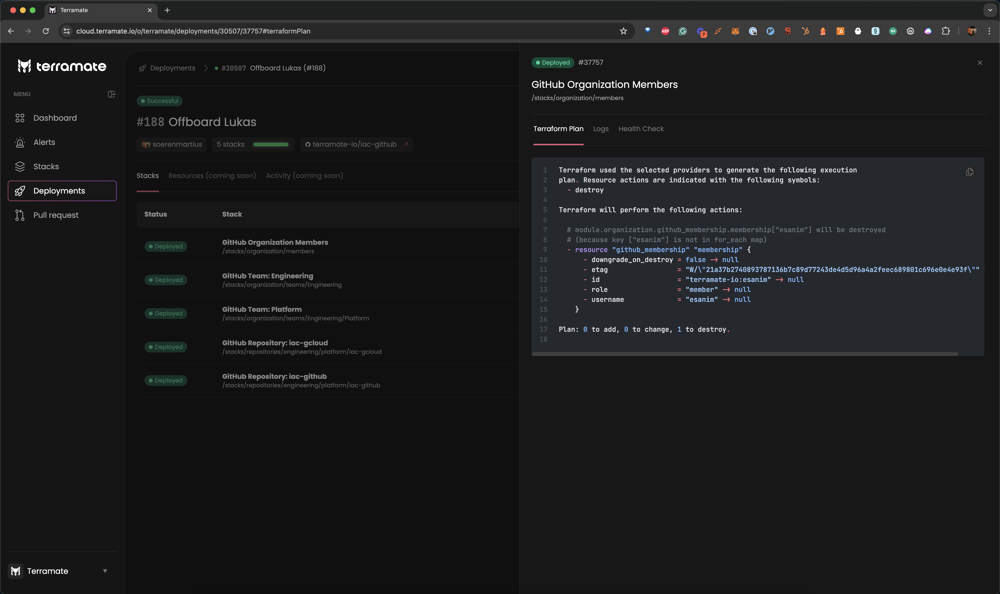

# Deployments

This section explains **deployments** as a core concept in Terramate.

## Introduction

Deployments are a record of provisioning or decommissioning infrastructure
resources in stacks with Terramate. You can use Terramate orchestration to create a
deployment for orchestrated commands such as `terraform apply` in Terramate Cloud.

Due to the distributed nature of stacks, a deployment bundles and tracks changes for one or multiple stacks.



For example, the following command will run `terraform apply` in all changed stacks
in parallel and create a record of the deployment and all deployed stacks in
Terramate Cloud.

```sh
terramate run \
  --changed \
  --parallel 5 \
  --sync-deployment \
  --terraform-plan-file=out.tfplan \
  -- \
  terraform apply -input=false -auto-approve -lock-timeout=5m out.tfplan
```
