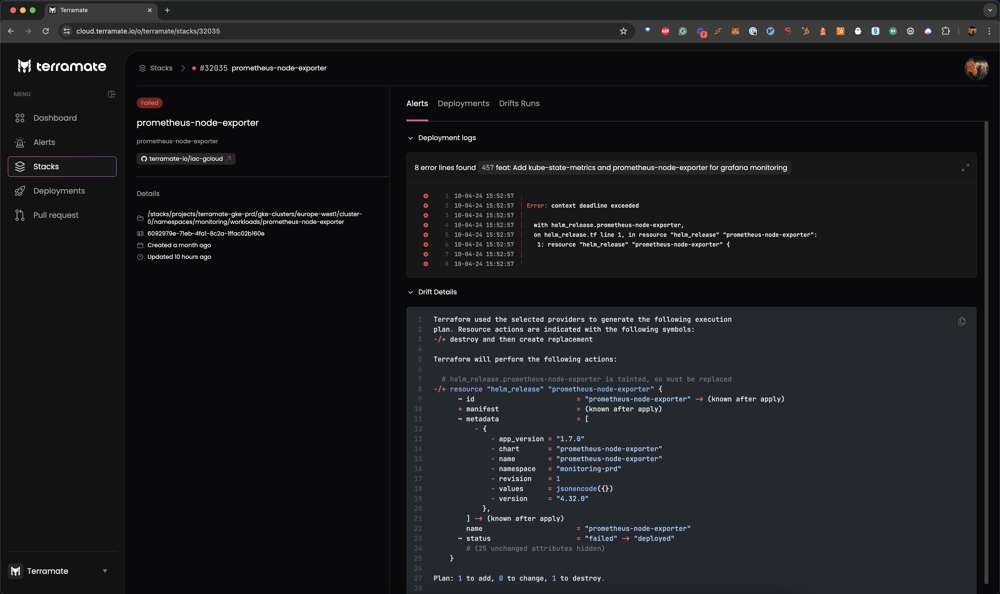

# Drift

This section explains **drift** as a core concept in Terramate.

## Introduction

Drift means that your Terraform code no longer represents your provisioned infrastructure, meaning that the infrastructure
diverges from your configuration.

Terramate helps you to detect drift by periodically running drift detection workflows in your CI/CD such as GitHub Actions, GitLab CI/CD or BitBucket pipelines. Upon detection of drift in stacks, Terramate will sync those drift to Terramate Cloud allowing
you to identify and manage drift

<!-- ## Types of Drift Detection -->
## Drift Reconciliation

We generally suggest enabling automated reconciliation as it ensures that you get the most out of drift detection.
Reconciliation jobs run in your CI/CD using configurable intervals. In addition, you can configure specific stacks to be
considered for reconciliation only by e.g. using a tag-based approach.
<!--  TODO: Add more reconciliation content-->
<!-- ## Alerts -->
