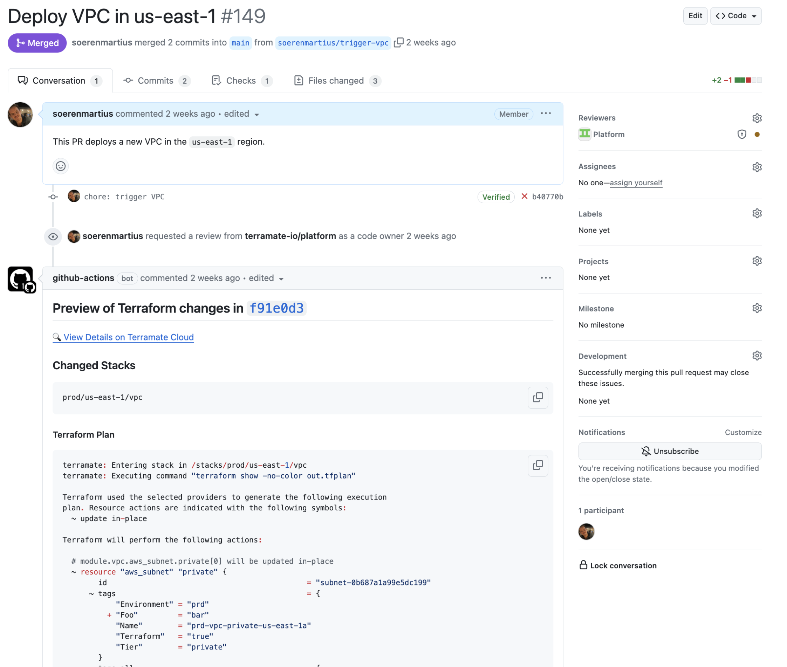

# Pull Requests

This section explains **pull requests** as a core concept in Terramate.

## Introduction

Terramate enables effective collaboration among team members by providing Pull Request-based workflows, allowing teams
to review and discuss proposed changes before merging a PR and applying them. This allows teams to keep track of changes,
configure reviewers, set up acceptance criteria for merging, and much more.

## Pull Request Integration

Terramate provides native Pull Request integration for GitHub, GitLab, BitBucket and others
to allow you to keep track of changes in Terramate Cloud.

For every new commit added to a Pull Request Terramate will run a preview of all changes and provide a summary directly
inside the Pull Requests. In addition, a detailed overview containing all changes, affected resources, policy evaluations,
etc. will be provided in Terramate Cloud.

<!-- ## Pull Request Previews -->

<!-- ## Pull Request Checks -->
