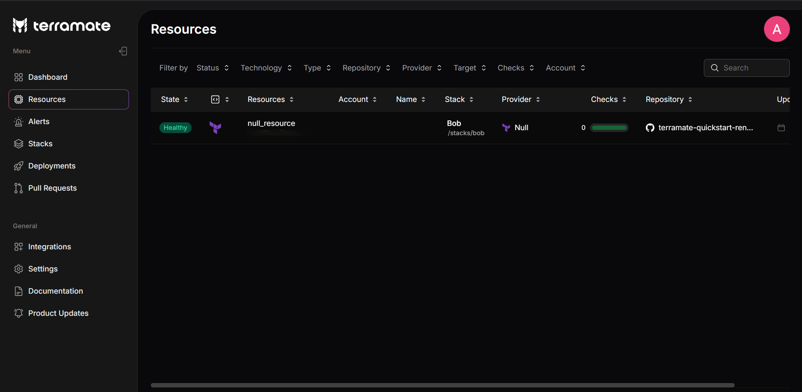

# Resources

Resources in the Terramate Cloud dashboard lets teams manage all their infrastructure assets from a single place. It monitors resources deployed with Infrastructure as Code (IaC) across multiple VCS providers, repositories, and teams, offering a complete picture of your infrastructure. The dashboard displays resource status, enabling teams to identify drifted or misconfigured assets based on deployment outcomes and drift runs.

The Resources page displays all known resources across multiple repositories. Each resource highlights its essential metadata. You can sort the list—by default, resources are arranged by the time of their last update—and use filters to narrow results by repository or status. Additionally, you can search for resources by entering a search string in the name or path. Clicking on any resource opens its [Resource Details](./details.md) page.

## Filter Options:

- **Status**: Filter resources by their current state:
    - `Healthy`: The resource is deployed successfully, and its current state matches the expected configuration.
    - `Drifted`: The resource is marked as drifted when its actual cloud state doesn't match the desired configuration. This discrepancy may result from manual changes, conflicting settings, provider issues, or similar events.
    - `Pending`: The resource is deploying for the first time, so its configuration is still being finalized. Some fields remain unpopulated until after the deployment (they are only known after `apply`). A subsequent drift check will fill in these fields and confirm that the configuration matches the cloud state.
- **Technology**: Filter resources based on the technology used, such as Terraform or OpenTofu.
- **Type**: Filter resources by category (e.g., compute instance, storage bucket, database) for quick identification.
- **Repository**: Filter resources by the repository that contains the resource.
- **Provider**: Filter resources by the cloud provider associated with them.
- **Target**: Specifies the environment where the resource is deployed.
- **Checks**: Filter resources by the policy checks executed against them.
- **Account**: Filter resources based on the associated account.

## Related guides

- [Set Up Drift Detection](/guides/set-up-drift-detection)
- [Manage Terraform at Scale](/guides/manage-terraform-at-scale)

## Related sections

- [Deployments](/deployments/)
- [Drift Management](/drift/)
- [Policies](/policies/)
