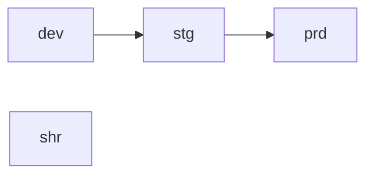

# Environments

Environments let you define promotion-oriented delivery stages globally and use them across bundles, components, and stacks. They are designed with promotion as a first-class citizen -- each environment has a single source of truth it can be promoted from.

## Concept



Each environment is defined globally and affects bundles, components, and stacks. Environments are optional -- bundles, components, and stacks can operate without them.

A stack can have either no environment or exactly one. Multiple environments per stack is not supported.

## Global configuration

Define environments in your root `terramate.tm.hcl` using `environment` blocks:

```hcl
environment {
  id          = "dev"
  name        = "Development"
  description = "Development Environment"
  # promote_from = null  # default, cannot be promoted to
}

environment {
  id           = "stg"
  name         = "Staging"
  description  = "Pre-Production Environment: Staging"
  promote_from = "dev"
}

environment {
  id           = "prd"
  name         = "Production"
  description  = "Production Environment"
  promote_from = "stg"
}

environment {
  id          = "shr"
  name        = "Shared"
  description = "A Shared Environment for global resources used by multiple environments."
  # promote_from = null  # default, cannot be promoted to
}
```

### Attributes

| Attribute | Required | Description |
|---|---|---|
| `id` | yes | Unique short alphanumeric identifier (`[A-Za-z0-9]+`). Use the same character length across all environments to avoid naming surprises in higher stages. Used to suffix cloud resources automatically at code generation. |
| `name` | no | Display name for use in scaffolding dialogs and generated documentation. Defaults to `id`. |
| `description` | no | Describes the purpose of the environment. Defaults to `name`. |
| `promote_from` | no | References the `id` of the environment this one inherits from. Set to `null` or omit to disable promotion. Defaults to `null`. |

### Promotion and input inheritance

`promote_from` defines a single source of truth for value inheritance:

- When `promote_from` is set, omitted bundle inputs are inherited from the promotion chain in order, then from the base configuration.
- When `promote_from` is not set (or `null`), values are inherited from the base configuration only.
- Bundle input defaults apply for inputs not set in any environment or base configuration.

Merge order: `base` -> `env(0)` -> `env(1)` -> `env(2)` -> ... where each `env(N)` is promoted from `env(N-1)`. If no values exist for a given environment, it is skipped and merging continues in order.

## Bundle configuration

Bundles declare environment support with an `environments` block inside `define bundle`:

```hcl
define bundle {
  alias = tm_slug(bundle.input.name.value)

  environments {
    required = true
  }

  scaffolding {
    path = "/configs/s3-buckets/s3_${tm_slug(bundle.input.name.value)}.tm.hcl"
    name = tm_slug(bundle.input.name.value)
  }
}
```

### Attributes

| Attribute | Default | Description |
|---|---|---|
| `required` | `false` | When `true`, the bundle cannot be used without environments configured in the project. |

When a bundle requires environments, `terramate scaffold` asks the user to select an initial environment.

## Bundle instance configuration

Per-environment overrides are defined alongside the base spec:

```yaml
apiVersion: terramate.io/cli/v1
kind: BundleInstance
metadata:
  name: fo
  uuid: 5cf600bb-ebe0-4bb6-9999-b9e1d76263d4
spec:
  source: /bundles/example.com/tf-aws-s3/v1
  inputs:
    name: fo
    visibility: private
environments:
  dev: {}
  stg:
    inputs:
      visibility: public-read
  prd:
```

The `environments` map defines specs per environment. Each entry can override:

- `source` -- use a different bundle source for this environment
- `version` -- use a different bundle version for this environment
- `inputs` -- override or set additional inputs (top-level merge only, no deep merge)

Operationally, Terramate generates a merged configuration for each environment and processes it independently.

HCL equivalent:

```hcl
bundle "fo" {
  uuid    = "5cf600bb-ebe0-4bb6-9999-b9e1d76263d4"
  source  = "/bundles/example.com/tf-aws-s3/v1"

  inputs {
    name       = "fo"
    visibility = "private"
  }

  environment "dev" {}

  environment "stg" {
    inputs {
      visibility = "public-read"
    }
  }

  environment "prd" {}
}
```

### Alias uniqueness

`bundle.alias` must be unique per environment and base. A base configuration cannot share the same alias as an environment configuration.

## The `bundle.environment` namespace

Inside bundle definitions, `bundle.environment` exposes the active environment during rendering:

| Attribute | Type | Description |
|---|---|---|
| `bundle.environment.available` | `bool` | Whether an environment is active for this bundle instance. |
| `bundle.environment.id` | `string` | The short identifier of the current environment. |
| `bundle.environment.name` | `string` | The display name of the current environment. |
| `bundle.environment.description` | `string` | The description of the current environment. |
| `bundle.environment.promote_from` | `string` or `null` | The `id` of the source environment, or `null`. |

Use these values to generate environment-specific paths, names, and tags:

```hcl
define bundle stack "s3-bucket" {
  metadata {
    path = "/stacks/${bundle.environment.id}/s3-buckets/${tm_slug(bundle.input.name.value)}-${bundle.environment.id}"
    name = "AWS S3 Bucket ${bundle.input.name.value}-${bundle.environment.id}"

    tags = [
      bundle.class,
      "environment/${bundle.environment.id}",
    ]
  }

  component "s3-bucket" {
    source = "./components/terramate-aws-s3-bucket"

    inputs {
      name = "${bundle.input.name.value}-${bundle.environment.id}"
      acl  = bundle.input.visibility.value

      tags = {
        "${bundle.class}/environment" = bundle.environment.id
      }
    }
  }
}
```

### Cross-bundle lookups with environment

`tm_bundle()` accepts an optional environment parameter to resolve bundles in a specific environment:

```hcl
tm_bundle("example.com/tf-aws-complete-ecs-fargate-cluster/v1", "my-cluster", bundle.environment.id)
```

This is how bundles reference infrastructure from other bundles within the same environment.

## Component configuration

Components can inherit environment context from the bundle stack they are instantiated in. The `component.environment` namespace mirrors `bundle.environment`:

| Attribute | Type | Description |
|---|---|---|
| `component.environment.available` | `bool` | Whether an environment is active. |
| `component.environment.id` | `string` | The short identifier. |
| `component.environment.name` | `string` | The display name. |
| `component.environment.description` | `string` | The description. |
| `component.environment.promote_from` | `string` or `null` | The source environment `id`, or `null`. |

Components can use `component.environment` as a default for inputs:

```hcl
define component {
  input "env" {
    default = component.environment
  }
}
```

## Constraints

- Stacks can have at most one environment. Multiple environments per stack is not supported.
- Bundles, components, and stacks can all operate without environments.
- `promote_from` uses a single-source model -- each environment has exactly one source. This prevents ambiguous merge precedence.
- Input overrides use top-level merge only, not deep merge.

## Related

- [Managing Environments overview](/environments/)
- [Bundles](/environments/bundles)
- [Components](/environments/components)
- [Self-Service Infrastructure](/self-service/)
- [Bundle Definition Reference](/environments/reference/bundle-definition)
