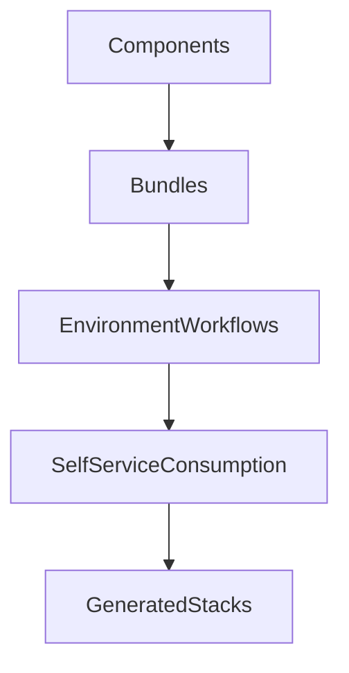

# Managing Environments

Terramate Environments let platform teams define delivery stages like `dev`, `stg`, and `prd` globally, then use those stages across bundles and stacks to generate environment-specific infrastructure, manage per-environment configuration overrides, and promote changes through a defined promotion chain.

The preferred operating model is:

1. standardize capabilities as components,
2. compose those capabilities into bundles,
3. define environments and promotion chains,
4. consume through self-service.

Stacks are the underlying execution units, but the user journey starts with components and bundles.

## Mental model

The dominant path is progressive:

Key rules:

- Bundles are composed from components.
- Environments define promotion-oriented delivery stages used across bundles and stacks.
- Self-service primarily consumes bundles, not raw components.
- Stacks are generated and orchestrated artifacts in this workflow.
- Code generation supports all stages.

## Preferred adoption path

### 1) Standardize with components

Create reusable building blocks with consistent contracts, defaults, and policy guardrails.

- [Components overview](/environments/components)
- [Convert a module to a component](/environments/convert-module-to-component)
- [Component definition reference](/environments/reference/component-definition)

### 2) Compose platform products with bundles

Use bundles as the primary interface for product teams and agents.

- [Bundles overview](/environments/bundles)
- [Create a component and bundle](/environments/create-a-component-and-bundle)
- [Bundle definition reference](/environments/reference/bundle-definition)

### 3) Define environments for promotion-oriented delivery

Define global environments with promotion chains and use them in bundles to generate environment-specific stacks, names, and tags automatically.

- [Environments](/environments/environments)

### 4) Expose self-service consumption

Provide a guided interface for developers and agents to instantiate approved bundles.

- [Self-service overview](/self-service/)
- [Instantiate your first bundle](/self-service/instantiate-your-first-bundle)
- [Use a remote catalog](/self-service/use-remote-catalog)

## CLI and Cloud touchpoints

### CLI
- [`terramate list`](/cli/reference/cmdline/list)
- [`terramate run`](/cli/reference/cmdline/run)
- [`terramate component create`](/cli/reference/cmdline/component/component-create)
- [`terramate package create`](/cli/reference/cmdline/package/package-create)
- [Code generation](/code-generation/)

### Cloud
- [Stacks Inventory](/stacks/)
- [Drift Management](/drift/)
- [Policies](/policies/)

## Next steps

- Follow the guided setup: [Create a component and bundle](/environments/create-a-component-and-bundle)
- Define environments and promotion chains: [Environments](/environments/environments)
- Add self-service consumption: [Instantiate a bundle via CLI](/self-service/instantiate-bundle-cli)
- Connect standards to generation: [Reference bundle values in codegen](/environments/reference-bundle-values-in-codegen)

## Related guides

- [Manage Terraform at Scale](/guides/manage-terraform-at-scale)
- [Migrate from Terraform-only workflows](/guides/migrate-from-plain-terraform)
