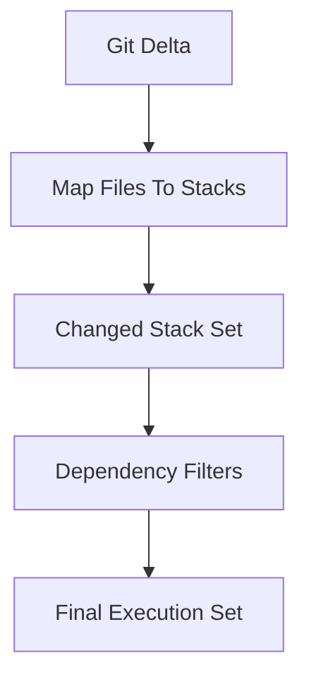

# Change Detection Model

Change detection is a selection strategy: it narrows execution to stacks likely impacted by repository deltas.

## Selection pipeline

## What it optimizes for

- lower CI runtime
- smaller blast radius
- clearer audit trail of why stacks were selected

## What it does not do

- It does not replace ordering logic.
- It does not infer business semantics from arbitrary code.
- It does not treat `before/after/wants/wanted_by` as data dependencies for dependency filters.

## Dependency filter semantics

- **include** expands the selected set with dependencies/dependents
- **only** replaces the selected set with those related nodes
- **exclude** removes related nodes from the selected set

Use these intentionally: they are powerful and can significantly widen execution scope.

## Common edge cases

- shared files changing multiple stacks at once
- generated file changes vs source-of-truth changes
- branch base mismatch leading to noisy selection

## Related docs

- How-to: [Run Commands Across Changed Stacks](/orchestration/change-detection/run-commands-across-changed-stacks)
- How-to: [Troubleshoot Change Detection](/orchestration/change-detection/troubleshoot-change-detection)
- Reference: [`terramate list`](/cli/reference/cmdline/list)
- Reference: [`terramate run`](/cli/reference/cmdline/run)
