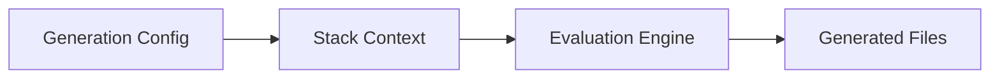

# Code Generation Model

Code generation keeps IaC DRY while preserving native generated output that teams can inspect and operate with standard tooling.

## Generation stages

1. Resolve generation blocks in hierarchy
2. Evaluate stack context and filters
3. Evaluate Terramate expressions (partial evaluation rules)
4. Render generated files to target stacks

## Conceptual model

## Why partial evaluation exists

Terramate evaluates Terramate-known expressions and preserves unknown runtime-tool expressions so downstream tools (Terraform/OpenTofu) can resolve them later.

This allows:

- central policy and defaults at generation time
- native tool semantics at execution time

## Core trade-offs

- **More generation:** stronger consistency, but less local explicitness
- **Less generation:** easier local readability, but more duplication risk
- **Broad filters:** easier rollout, but wider change impact

## Related docs

- How-to: [Generate HCL](/code-generation/generate-hcl)
- How-to: [Generate Files](/code-generation/generate-file)
- Reference: [`terramate generate`](/cli/reference/cmdline/generate)
- Reference: [`generate_hcl` block](/cli/reference/blocks/generate-hcl)
