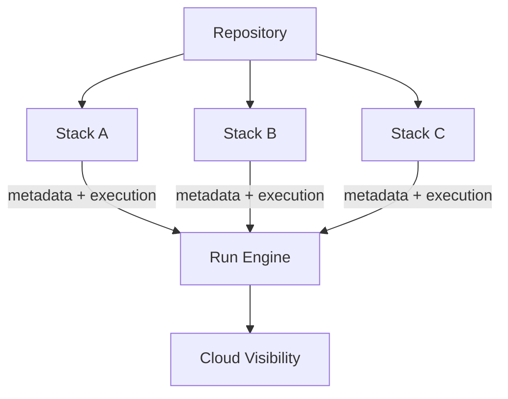

# Stacks Model

Stacks are Terramate's deployable units. They create explicit boundaries for execution, ownership, and observability.

## Why stacks exist

Without stack boundaries, large IaC repositories often rely on ad-hoc script loops, implicit coupling, and broad blast radius.

Stacks let teams:

- define execution targets clearly
- model ownership at the right granularity
- parallelize safely
- keep cloud visibility aligned with deployment units

## Conceptual model

## Key design trade-offs

- **Smaller stacks:** better isolation and faster targeting, but more orchestration overhead
- **Larger stacks:** simpler topology, but higher blast radius and slower feedback
- **Path-based topology:** easy to reason about, but tag strategy is still important for cross-cutting workflows

## Related docs

- How-to: [Create Stacks](/stacks/create)
- How-to: [Configure Stacks](/stacks/configuration)
- Reference: [`terramate create`](/cli/reference/cmdline/create)
- Reference: [`terramate list`](/cli/reference/cmdline/list)
