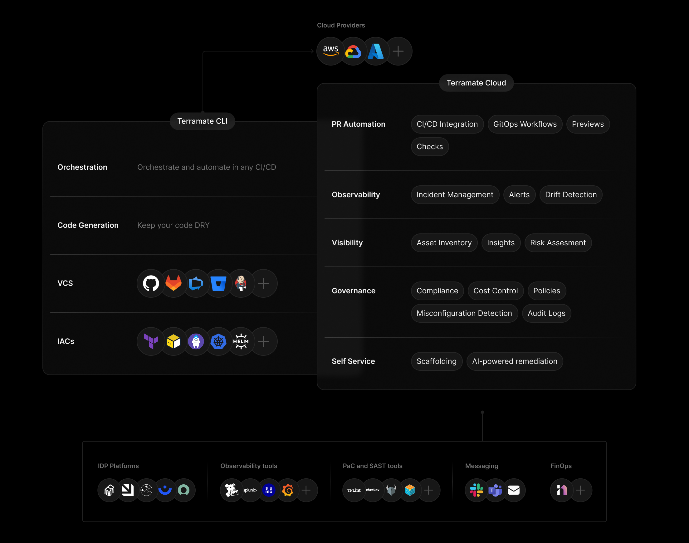
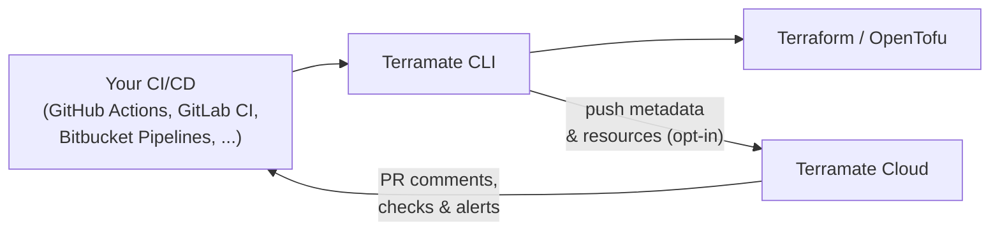

# About Terramate

Terramate is the **Infrastructure as Code (IaC) Development Platform** that helps platform teams, developers, and AI agents deploy and
manage cloud infrastructure at scale with Terraform, OpenTofu, Terragrunt, and Kubernetes so they can ship faster across teams,
reduce risk and platform toil, and maximize the value of their existing IaC investment.

The platform consists of two components:

<div class="tm-overview-grid">
  <a href="https://github.com/terramate-io/terramate" class="tm-overview-card" target="_blank" rel="noreferrer noopener">
    <h3>Terramate CLI <span class="tm-badge">OSS</span></h3>
    <p>Structure, orchestrate, and automate IaC locally and in any CI/CD.</p>
    <ul class="tm-capabilities">
      <li>Stacks</li>
      <li>Environment management</li>
      <li>Code generation</li>
      <li>Dependency-aware orchestration</li>
      <li>Change detection</li>
      <li>Parallel execution</li>
      <li>State-aware retries</li>
      <li>CI/CD & GitOps automation</li>
      <li>Self-service infrastructure</li>
    </ul>
  </a>
  <a href="https://cloud.terramate.io" class="tm-overview-card" target="_blank" rel="noreferrer noopener">
    <h3>Terramate Cloud <span class="tm-badge">SaaS</span><span class="tm-badge">BYOC</span></h3>
    <p>Observe, collaborate, and govern infrastructure delivery at scale.</p>
    <ul class="tm-capabilities">
      <li>Dashboard</li>
      <li>Pull request previews</li>
      <li>Deployment tracking</li>
      <li>Drift management</li>
      <li>Alerts</li>
      <li>Policy controls</li>
      <li>DORA insights</li>
      <li>AI agents</li>
      <li>MCP server & skills</li>
      <li>SlackOps workflows</li>
      <li>Integrations</li>
    </ul>
  </a>
</div>



## Architecture

Terramate CLI runs locally or in your CI/CD and executes infrastructure workflows where your code already lives.
It then pushes metadata and workflow outcomes to Terramate Cloud for visibility, governance, and collaboration.



Terramate CLI orchestrates Terraform/OpenTofu inside your CI/CD runner, then pushes deployment, preview, and drift metadata to Terramate Cloud. Cloud closes the loop by reporting results back to your pull requests as comments, status checks, and alerts.

::: tip Important
Terramate is **not** a CI/CD platform. It runs inside your existing delivery setup, so you keep your current CI/CD, secrets management, and permissions model (for example, GitHub Actions, GitLab CI/CD, Bitbucket, Azure DevOps, Atlantis, CircleCI, and Jenkins).
::::

Terramate Cloud does not require access to your source code / repositories, Terraform state backend, or cloud accounts.

## How a typical workflow works

1. **Define**: Organize infrastructure into environments with bundles, components, and stacks, and keep them DRY by using reusable code generation patterns.
2. **Orchestrate**: Change detection identifies which environments contain changes and orchestrates `plan`/`apply` only there, instead of running across the entire repository.
3. **Preview**: Run plans in pull requests to review impact and risk before applying changes.
4. **Deploy**: Execute dependency-aware applies with parallel execution and state-aware retries.

## Day-2 operations

Once infrastructure is running, Terramate keeps it healthy:

- **Observe**: Track deployments, detect drift, and route alerts through Terramate Cloud.
- **Maintain**: Use AI agents to update, remediate, and maintain infrastructure with less day-2 effort.

## CLI in action

Run `terraform apply` only in changed stacks and sync deployment data to Terramate Cloud:

```sh
terramate run \
  --changed \
  --parallel 5 \
  --sync-deployment \
  --terraform-plan-file=out.tfplan \
  -- \
  terraform apply -input=false -auto-approve out.tfplan
```

What this command does:

- `terramate run` executes any command across targeted stacks. In this example, it orchestrates `terraform apply`.
- `--changed` runs only in stacks affected by your changes, not across the whole repository.
- `--parallel 5` executes up to five eligible stacks concurrently for faster delivery.
- `--terraform-plan-file=out.tfplan` explicitly sets the plan filename created in each stack, which Terramate uses to extract resources and metadata for Terramate Cloud sync.
- `--sync-deployment` is explicit opt-in; remove this flag to run locally or in CI without syncing to Terramate Cloud.

## Security and data handling

Terramate uses a push-based model: execution happens in your local or CI environment, and Terramate CLI pushes workflow data to Terramate Cloud.
Terramate Cloud does not require direct access to your source code, Terraform state files, or cloud provider accounts.

- **Execution control stays with you**: Keep Terraform/OpenTofu execution in your own runtime and permission boundary.
- **Data flow is explicit**: Send only the deployment, preview, and drift metadata needed for visibility and collaboration.
- **Client-side sanitization**: When extracting resources from plan files, Terramate CLI redacts all sensitive values -- such as secrets, certificates, and credentials -- on the client side before pushing any data to Terramate Cloud. No sensitive data ever leaves your environment.
- **Security docs**: Learn more in [Security and Data Processing](/security/).

## Next steps

- [Install Terramate CLI](/cli/installation)
- Onboard an existing project: [Terraform](/get-started/terraform), [OpenTofu](/get-started/opentofu), [Terragrunt](/get-started/terragrunt)
- [Set up Terramate Cloud](/guides/set-up-terramate-cloud)

## Learn more

- [Why Terramate](/why-terramate)
- [Concepts](/explanations/)
- [Security and Data Processing](/security/)
- Join the [Discord community](https://terramate.io/discord)
