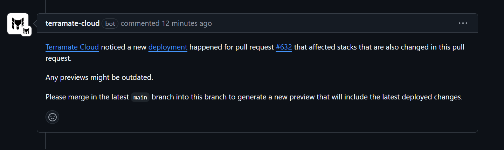

# Detecting Deployment Conflicts

A new deployment may change stacks involved in an already open PR. This means the generated preview in such PRs (or draft PRs) is outdated. Merging PRs with outdated previews means you do not know the actual changes that will be made in the live infrastructure, which can lead to unintended consequences.

To help you prevent this, the Terramate App for GitHub reviews all open and drafted Pull Requests after a deployment to identify any conflicts. When a conflict is detected, it posts a comment in the affected PR, highlighting the issue caused by the deployment.

Example:

