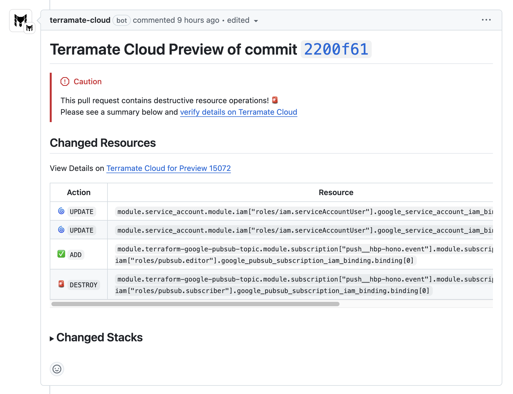
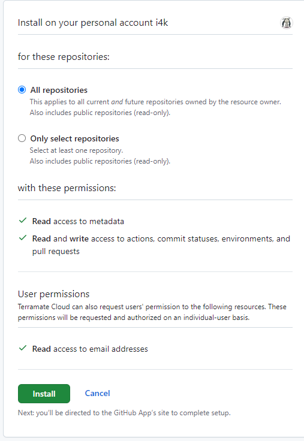
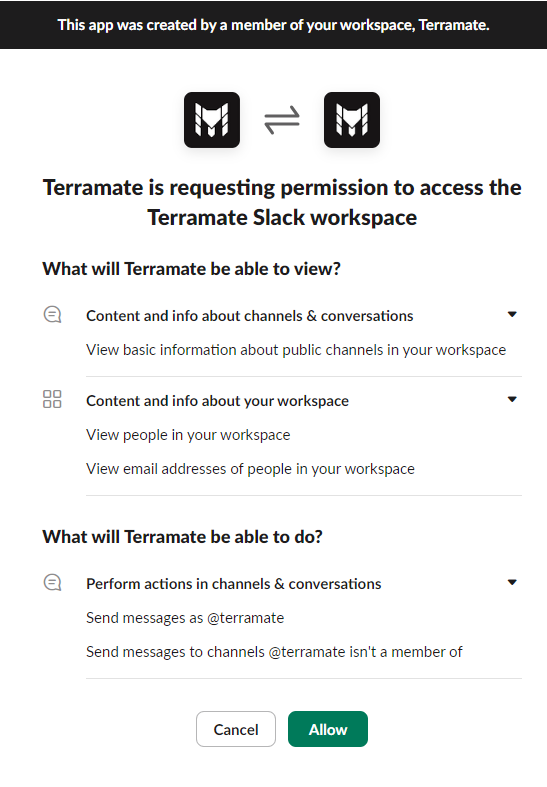

# Security and Data Access Overview

This page provides an overview of what data [Terramate CLI](https://github.com/terramate-io/terramate) and
[Terramate Cloud](https://cloud.terramate.io/) access and process through the various integrations.
Terramate follows a unique approach by shifting all orchestration capabilities to the client site via
[Terramate CLI](https://github.com/terramate-io/terramate).

Because of that, Terramate CLI and Terramate Cloud are designed to be highly secure, meaning that:

- Terramate doesn't require any access to your cloud accounts.
- Terramate doesn't require any access to your state files.
- Terramate doesn't require any access to your source code.

This differentiates Terramate highly from other solutions such purpose-built CI/CD
platforms for IaC in the market, since those mostly require broad access to your
state and cloud accounts in order to deploy changes.

For details, please consider the following sections on this page.

## Terramate CLI

Per default, Terramate CLI does not process or sync any data to Terramate Cloud.

When authenticating Terramate CLI with Terramate Cloud via the
[`terramate cloud login`](https://terramate.io/docs/cli/reference/cmdline/cloud/cloud-login)
command, plan files such as Terraform plans and metadata such as Git metadata can be synced **optionally** for
[Pull Requests](../cloud/previews/index.md), [Deployments](../cloud/deployments/index.md), and [Drift Detection Checks](../cloud/drift/index.md).

For details, please consider the [Cloud Sync](#cloud-sync) section.

### Cloud Sync

Terramate CLI optionally allows you to sync plans and metadata to Terramate Cloud,
allowing you to provide better Pull Request Previews, Deployment Insights,
Drift Detection, Asset Management, Policies, and more.

Syncing data to Terramate Cloud requires explicit **opt-in**, and is available for
the following operations:

- Syncing Pull Requests to Terramate Cloud via [`terramate run`](../cli/reference/cmdline/run.md) or custom workflows configured with [Terramate Scripts](https://terramate.io/docs/cli/orchestration/scripts#command-options).
- Syncing Deployments to Terramate Cloud via [`terramate run`](../cli/reference/cmdline/run.md) or custom workflows configured with [Terramate Scripts](https://terramate.io/docs/cli/orchestration/scripts#command-options).
- Syncing Health Checks such as Drift Checks to Terramate Cloud via [`terramate run`](../cli/reference/cmdline/run.md) or custom workflows configured with [Terramate Scripts](https://terramate.io/docs/cli/orchestration/scripts#command-options).

For example, the following command creates a plan file `preview.tfplan` in all stacks, and syncs those as Pull Request Previews to Terramate Cloud:

```sh
terramate run \
  --sync-preview
  --terraform-plan-file=preview.tfplan \
  -- \
  terraform plan -out preview.tfplan -detailed-exitcode
```

This will:
1. Run the command `terraform plan -out preview.tfplan -detailed-exitcode` in each stack, which will run `terraform plan` and safe the plan to a file `preview.tfplan` in each stack.
2. Terramate will then sanitize those plans to redact all sensitive values.
3. Once sanitized, Terramate will sync all plan files to Terramate Cloud and bundle them as a new Pull Requests Preview.

Sanitizing the plans guarantees that no sensitive data such as secrets, certificates or any other form of sensitive data
will be sent to Terramate Cloud. To learn more about how plan sanitization works, please see the
[Plan sanitization section](#plan-sanitization) in this page.

Once finished, Terramate Cloud will summarize of all plans inside the Pull Request in your VCS.



### Which Data gets synced from Terramate CLI to Terramate Cloud

Whenever syncing operation such as Pull Request Previews, Deployments and Drift Checks from Terramate CLI to Terramate Cloud,
Terrmate CLI will sync the following data:

- **[Extracted and sanitized data from plans](#plan-sanitization)**
- **Github metadata** (user has granular control of the token permissions)

| Scope              | Access / Data Processed                                                                                                                                                                                   |
|--------------------|-----------------------------------------------------------------------------------------------------------------------------------------------------------------------------------------------------------|
| Pull Request API   | Number, Title, Body, Labels, Draft, Head branch, base branch, author, HEAD commit, URL, reviewers (name, username), Review Decision (approved, requested change, etc.)                                    |
| Checks API         | Successful / failed / pending jobs                                                                                                                                                                        |
| Github Actions API | Deployment Actor (`GITHUB_ACTOR` env), Triggered By Actor (`GITHUB_TRIGGERING_ACTOR` env), Run ID (`GITHUB_RUN_ID` env) and Run Attempt (`GITHUB_RUN_ATTEMPT` env), Workflow name (`GITHUB_WORKFLOW` env) |

- **Gitlab metadata** (user has granular control of the token permissions)

| Scope             | Access / Data Processed                                                                               |
|-------------------|-------------------------------------------------------------------------------------------------------|
| Merge Request API | ID / IID, Project, Title, Body, Labels, Author, Target branch, Source branch, Draft, HEAD Commit, URL |
| CI/CD Info        | Pipeline Information (ID, Source, URL, etc), Job Information (ID, Name, Started At, etc)              |

- **Bitbucket metadata** (user has granular control of the token permissions)

| Scope             | Access / Data Processed                                                                               |
|-------------------|-------------------------------------------------------------------------------------------------------|
| Pull Request API | ID, Title, State, Author, Source/Destination branch, Reviewers, Participants |
| Pipelines Info   | Pipeline Information (UUID, Build Number, Step UUID, etc), Workspace and Project (Name, UUID, Slug name, etc) |

### Plan Sanitization

Whenever syncing plans to Terramate Cloud, Terramate CLI first sanitizes plans locally by using an
[open-source library](https://github.com/terramate-io/tfjson) we maintain which we welcome you to audit.

The following data is extracted from all JSON plan files and synced to Terramate Cloud if cloud sync is explicitly enabled via
opt-in:

- Resources
  - Name
  - Values (**REDACTED**)
- Providers used
- Data sources
  - Name
  - Values (**REDACTED**)
- Variables
  - Name
  - Values (**REDACTED**)
- Outputs
  - Name
  - Values (**REDACTED**)
- Provider config (**REDACTED**)
- Planned Values / Module Calls / Previous State, etc (all **REDACTED**)

## Terramate Cloud

### Data processed when authenticating with SSO

You can login to Terramate Cloud using various SSO providers. Below is an overview of data access requested for each provider.

#### Google SSO

- name, email address, language preferences and profile picture.

#### GitHub SSO

- Personal user data, email addresses

#### Microsoft Entra SSO

- name, email address, profile picture

#### GitLab SSO

- openid (Authenticate using OpenID Connect)
- profile (Allows read-only access to the user's personal information using OpenID Connect)
- email (Allows read-only access to the user's primary email address using OpenID Connect)

### Integrations

The following section explains the access scopes required by the individual integrations available in Terramate Cloud.

#### App for GitHub

::: info
The App for GitHub doesn't require any access to your source code.
:::

The [Terramate App for GitHub](https://github.com/apps/terramate-cloud) is required to provide Previews inside of [Pull Requests](https://docs.github.com/en/pull-requests/collaborating-with-pull-requests/proposing-changes-to-your-work-with-pull-requests/about-pull-requests) and to integrate
policy checks with the [GitHub Checks API](https://docs.github.com/en/pull-requests/collaborating-with-pull-requests/collaborating-on-repositories-with-code-quality-features/about-status-checks).

The following scopes are required when installing the App for GitHub.

- **Read** access to metadata
- **Read** and **write** access to actions, commit statuses, environments, and pull requests
- **Read** access to email addresses



#### GitLab

• **openid** (Authenticate using OpenID Connect)
• **profile** (Allows read-only access to the user's personal information using OpenID Connect)
• **email** (Allows read-only access to the user's primary email address using OpenID Connect)

When integrating [GitLab CI/CD](https://docs.gitlab.com/ee/ci/), the following scopes of permissions are required:

#### App for Slack

The App for Slack is used to integrate notifications such as [Alerts](../cloud/alerts/index.md) with your Slack Workspace
by providing a Slack Bot.

The following scopes of permissions are required to install the App for Slack in your workspace:

- View basic information about public channels in your workspace
- View people in your workspace
- View email addresses of people in your workspace
- Send messages as @terramate
- Send messages to channels @terramate isn't a member of



#### Slack Webhook

In addition to the App for Slack, Terramate Cloud also allows you to configure a webhook used for sending notifications about
failed deployments, detected drifts, etc. to a centralize Slack channel.

This requires you to [configure a webhook](https://api.slack.com/messaging/webhooks) in your Slack Workspace authorized to
send messages to a selected channel. For details, please see the [webhook documentation for Slack](https://api.slack.com/messaging/webhooks).
