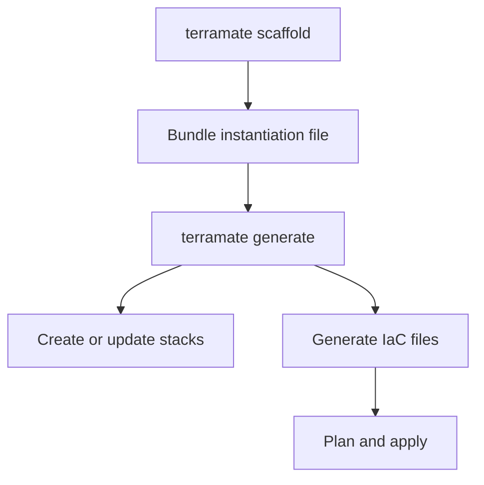

# Scaffolding and Code Generation

Self-service in Terramate follows a simple loop:

1. Scaffold a bundle instance (`terramate scaffold`)
2. Generate code (`terramate generate`)
3. Plan/apply with your existing tooling
4. Reconfigure inputs when needed

### Related

- How-to: [How to Instantiate a Bundle via CLI](/self-service/instantiate-bundle-cli)
- How-to: [How to Reconfigure a Bundle](/self-service/reconfigure-bundle)
