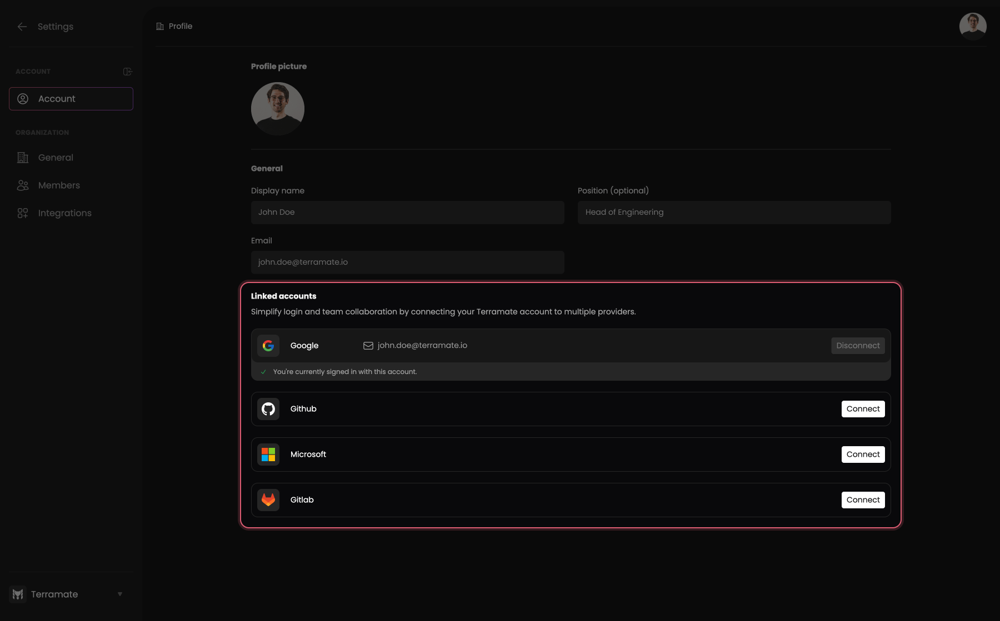

# Account Linking

To utilize features like [Pull Requests Previews](../previews/index.md), [Deployment Insights](../deployments/index.md), [Drift Detection](../drift/index.md), and [Alerts](../alerts/index.md) in Terramate Cloud, you need to link your GitLab, GitHub, Microsoft, and Slack accounts.

For instance, to associate Pull Requests opened in GitHub with your Terramate Cloud account, you must establish an account mapping between your Terramate Cloud and GitHub user.

Terramate allows you to connect the following platforms to your Terramate Cloud account:

- **GitHub:** Links your GitHub account to your Terramate Cloud user, enabling association with Pull Request Previews, Deployments, and detected drift for repositories managed on GitHub.
- **GitLab:** Links your GitLab account to your Terramate Cloud user, enabling association with Pull Request Previews, Deployments, and detected drift for repositories managed on GitLab.
- **Slack (coming soon):** Links your Slack account to your Terramate Cloud user, allowing the bot for Slack provided by the [App for Slack integration](../integrations/slack.md) to send direct messages about failed deployments or detected drift.

You can link your accounts in the [profile section](./index.md) of your Terramate Cloud account. We recommend linking all third-party platforms you use with Terramate Cloud.

