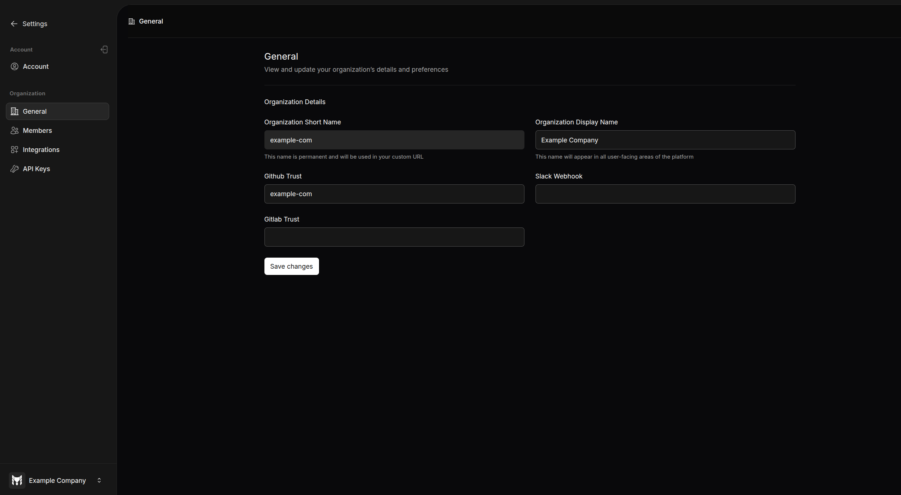

# General Settings

Sync your complete GitHub/GitLab organization or specific repos with Terramate Cloud via. Organization. To collaborate with your team members on Terramate Cloud, you can create a new Organization or join an existing one.

## General Settings

These settings give your new organization an identity to refer to and enable full features of the Terramate Cloud. You can change these fields only if you're an `admin`.

- `Short Name`: The short name is the string which will be used in URLs (https://cloud.terramate.io/o/{short-name}) when visiting the organization or in Terramate CLI when selecting the organization to sync or receive data from. You can only set it when creating a new organization. You cannot change it afterwards. Please get in touch with our support for more details.

- `Display Name`: The Display name is the publicly visible name of your Terramate Organization, which will appear in different places, like in the invitation emails to your teammates to join the `display name` organization.

## Setup VCS Open ID Connect (OIDC)

When syncing data with Terramate CLI from your VCS such as GitHub Actions and GitLab CI/CD, we recommend you use Open ID Connect (OIDC)
instead of api keys. For that you can establish trust relationship between your VCS provider and Terramate Cloud.

- `GitHub Trust`: Set up OpenID Connect(OIDC), which allows Terramate CLI to sync data from GitHub Actions to Terramate Cloud. You can do this by entering one of the following types of values in this field:
    - a GitHub Organization/Owner to trust all repositories within a GitHub Organization of the form `owner`
    - a comma-separated list of GitHub Organizations/Owners of the form `ownerA`, `ownerB`, `ownerC`
    - a GitHub repository to trust a single repository within a GitHub Organization of the form `owner/repository`
    - a comma-separated list of GitHub repositories ofthe form `organizationA/repository`, `organizationB/repository`

- `GitLab Trust`: Similar to the `GitHub Trust` field, you can enter a value which will set up OIDC to sync data from GitLab CI to Terramate Cloud. You can visit this [page](https://terramate.io/docs/ci-cd/gitlab-ci/#terramate-cloud-integration) to see more details about connecting Terramate Cloud to GitLab CI. The following values are supported:
    - a GitLab Organization/Owner to trust all repositories within a GitLab Organization of the form `owner`
    - a comma-separated list of GitLab Organizations/Owners of the form `ownerA`, `ownerB`, `ownerC`
    - a GitLab Repository to trust a single repository within a GitHub Organization of the form `owner/repository`
    - a comma-separated list of GitLab repositories ofthe form `organizationA/repository`, `organizationB/repository`

## Webhook for Slack (deprecated)

::: info
Webhook for Slack in Terramate Cloud are deprecated and will soon be replaced with the [Terramate App for Slack](../integrations/slack.md).
:::

- `Webhook for Slack`:
Terramate Cloud can send alerts to notify you about important events, such as failed deployments or detected drift. Terramate can automatically deliver such alerts directly to individuals and teams on Slack. You can follow the below-mentioned steps to integrate Terramate Cloud with your Slack workspace:

  1. Create a new app from the [Slack API page](https://api.slack.com/apps) by clicking **Create New App** and selecting **From Scratch**.
  2. Enter a name for your App for Slack in the **App Name** field.
  3. Choose your Slack workspace in the **Pick a Workspace** field, then click **Create App**.
  4. The new app page opens. Click on **Incoming Webhooks** in the left navigation pane.
  5. Toggle the **Activate Incoming Webhooks** button to **On**.
  6. Click the **Add New Webhook to Workspace** button.
  7. Select a channel where you want the webhook to post notifications.
  8. Click **Allow** to grant permissions.
  9. Copy the generated webhook URL.
  10. Paste the copied webhook URL into the Webhook for Slack field in the General Settings page of Terramate Cloud.
