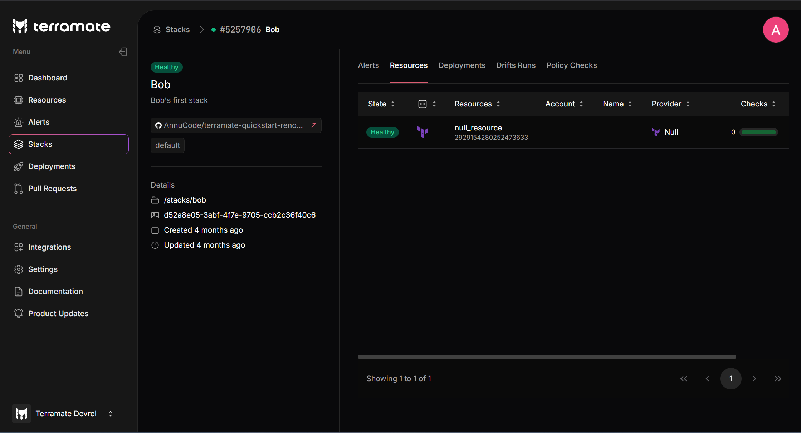

# Stack Details

The stack details page displays all stack metadata configured in Terramate CLI and collected by Terramate Cloud. Additionally, more information is shown based on the stack status.

## Stack Metadata

On the details page, the following information is available

- The **name** of the stack, set in the Terramate config via `stack.name`
- The **description** of the stack, set in the Terramate config via `stack.description`
- The **repository** containing the stack. Clicking on the repository name opens a new tab and directs you to the stack within the repository on GitHub.
- The **path** of the stack within the repository
- The **ID** of the stack, set in the Terramate config via `stack.id`
- The **created date and time** when the stack was added to Terramate Cloud
- The **updated date and time** when the stack status was last updated
- The **tags** configured for the stack via `stack.tags`
- The **Policy Checks** applied to the stack to ensure it meets your organization’s standards.
- The **Alerts** associated with the stack

## Stack Alerts

For [`failed`](../alerts/index.md#failed-deployment) stacks, the deployment error logs provide details about the failed command and highlight errors. You can expand these logs to see the full context and all lines from the deployment command. Any additional drift detected will be displayed as a `terraform plan`.

For [`drifted`](../alerts/index.md#detected-drift) stacks, the details of the drift are displayed as a `terraform plan`.

## Deployments

Each stack has a list of historic deployments the stack was included in.

This information helps to detect the deployment that introduces the `failed` state. Each deployment can be used to visit the deployment in GitHub Actions, GitLab CI/CD or any other [supported CI/CD platform](..//ci-cd/index.md).

See [Deployments](../deployments/index.md) to learn how to synchronize deployments with Terramate Cloud.

## Drift Runs

Each stack has a list of historic drift runs the stack was included in.

This information helps to detect the point in time when a drift was first detected and if a drift was related to a specific deployment.

See [Drift Detection](../drift/index.md) to learn how to synchronize drift runs with Terramate Cloud.
